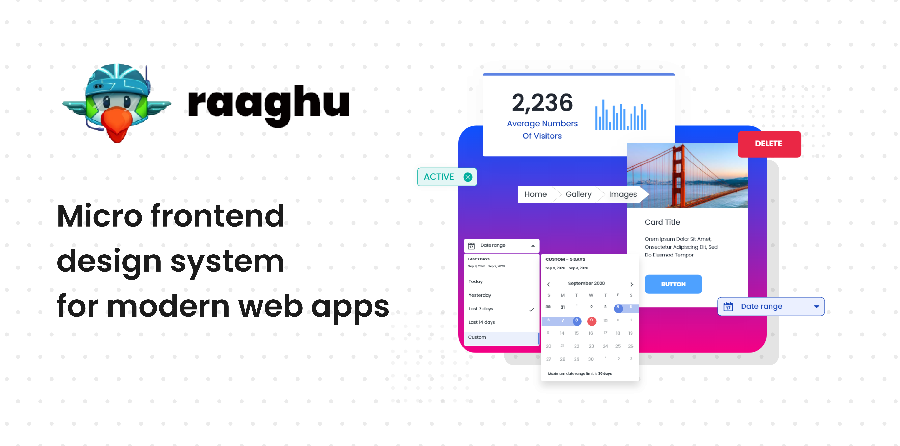

<!-- ALL-CONTRIBUTORS-BADGE:START - Do not remove or modify this section -->
<!-- ALL-CONTRIBUTORS-BADGE:END -->

    

 
   

<h3 align="center" style="border-bottom:0;">
    <a href="https://raaghu.io" target="blank">Get Started</a>
    ·
    <a href="https://raaghu.io" target="blank">Tutorials </a>
    ·
    <a href="https://raaghu.io" target="blank">View Demo</a>
    ·
    <a href="https://github.com/Wai-Technologies/raaghu-elements/issues/new">Report Bug</a>
    ·
    <a href="https://github.com/Wai-Technologies/raaghu-elements/issues/new">Request Feature</a>
    
</h3>

    A progressive Angular based framework leveraging micro front end capabilities to build efficient, reliable   and scalable  front-end applications. 

  
<h1 align="center" style="border-bottom:0;">
What is Raaghu?
</h1>

`raaghu-elements` is an opensource Angular library framework built on top of Bootstrap 5 and Storybook offering highly customizable and reusable Angular UI elements. Raaghu elements can be used as a base to build complex components and UI layouts whilst maintaining a high level of reusability.

    

<h3 align="center" style="border-bottom:0;">
Here's how Raaghu works
</h3>
    

    

        

## WAi Technology Contributors ✨

Thanks goes to these wonderful people and Wai technology.

<!-- ALL-CONTRIBUTORS-LIST:START - Do not remove or modify this section -->
<!-- prettier-ignore-start -->
<!-- markdownlint-disable -->

[Omkar Choudhari](https://github.com/omkarchoudhari), [Alok Nakhate](https://github.com/alok-nakhate), [Rohit Pingale](https://github.com/pingroh), [Mohan Bari](https://github.com/mohanbari), [Apoorva Lele](https://github.com/apoorvalele), [Yohul Chitre](https://github.com/yohulchitre),
[Priyanka Shinkar](https://github.com/Priyanka-Shinkar), [Suraj Khupse](https://github.com/suraj-khupse), [Pratheesh Krishnan](https://github.com/pratheesh-rishnan), [Rahul Patil](https://github.com/rahulp34),
[Ketan khalate](https://github.com/Ketan-Khalate), [Obaid Ur Rahman](https://github.com/obaid-ur-rahman), [Anupriya Biju](https://github.com/Anupriya-Biju), [Niphy Anto](https://github.com/Niphy-Anto),
[Neeraj Bhakre](https://github.com/neeraj-bhakre), [Basavraj Chorgasti](https://github.com/basavraj-chorgasti), [Shrikant Birajdar](https://github.com/shrikant-birajdar), [Omkar Rairikar](https://github.com/omkarrairikar),
[Swapnil Ghormode](https://github.com/DevSwapnil22)

<!-- markdownlint-restore -->
<!-- prettier-ignore-end -->

<!-- ALL-CONTRIBUTORS-LIST:END -->

This project follows the [all-contributors](https://github.com/all-contributors/all-contributors) specification. Contributions of any kind are welcome!

