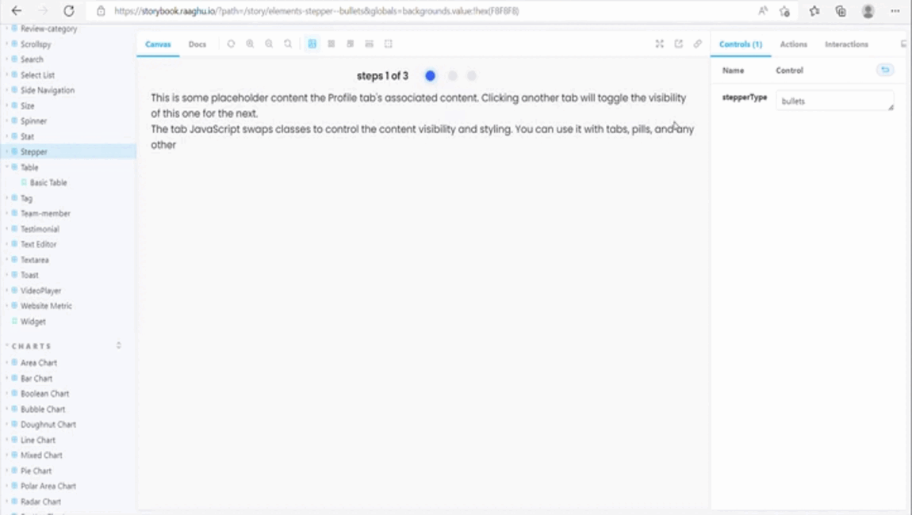

<p align="center">
    <a href="https://raaghu.io" target="_blank">
        
    </a>
<p/>
</p>
<p>
<h1 align="center">raaghu Elements</h4>
</p>

<p align="center">
<a href="https://npmjs.org/rds-elements"></a>
<a href="https://npmjs.org/rds-elements"></a>
</br>
<a href="https://github.com/Wai-Technologies/raaghu/blob/main/LICENSE" target="blank">

</a>
<a href="https://github.com/Wai-Technologies/raaghu/stargazers" target="blank">

</a>
<a href="https://github.com/Wai-Technologies/raaghu/issues" target="blank">

</a>
<a href="https://github.com/Wai-Technologies/raaghu/pulls">

</a>
</p>

<p align="center">
    <a href="https://raaghu.io" target="blank">View Demo</a>
    ·
    <a href="https://github.com/Wai-Technologies/raaghu/issues/new">Report Bug</a>
    ·
    <a href="https://github.com/Wai-Technologies/raaghu/issues/new">Request Feature</a>
</p>
<h1 >Table of content</h4>
<!-- vscode-markdown-toc -->

* [ Introducing raaghu-elements](#Introducingraaghu-elements)
*  [Demo](#Demo)
*  [Features](#Features)
	*  [ High reusability](#Highreusability)
	*  [ Responsive and mobile-friendly](#Responsiveandmobile-friendly)
*  [How to Set up `raaghu-elements` for Development?](#setup)
*  [Built With](#BuiltWith)
*  [License](#License)
*  [Upcoming Features](#UpcomingFeatures)
*  [ Contributing to `raaghu`](#ContributingtoRaaghu)
*  [ Support](#Support)
*  [WAi Technology Contributors](#WAiTechnologyContributors)

<p align="center">

##  <a name='Introducingraaghu-elements'></a> Introducing raaghu-elements 

`raaghu-elements` is an opensource Angular library framework built on top of Bootstrap 5 and Storybook offering highly customizable and reusable Angular UI elements.

Raaghu elements can be used as a base to build complex components and UI layouts whilst maintaining a high level of reusability.


##  <a name='Demo'></a>Demo

Here is a quick demo of the elements. We hope you enjoy it.


Liked it? Please give us a ⭐️ to show your appreciation

Many Thanks to all the `supporters` who have helped this project with stars(⭐)

##   <a name='Features'></a> Features

###  <a name='Highreusability'></a> High reusability
 - Promotes reusability throughout the UI and pages
 - Reduces code duplication and helps in delivering a more consistent and even UI

### <a name='Responsiveandmobile-friendly'></a> Responsive and mobile-friendly
- All of the elements are built for a wide variety of screen sizes


## <a name='setup'></a> How to Set up `raaghu-elements` for Development?

You can run `raaghu-elements` locally with a few easy steps.

1. Clone the repository

```bash
git clone https://github.com/Wai-Technologies/raaghu.git
```

2. Change the working directory

```bash
cd raaghu-elements
```

3. Install dependencies

```bash
npm install
```

4. Build all the libraries

```bash
npm run build-all
```
> **_NOTE:_** Above command will create a folder named "rds-elements" with all the libraries

5. Create a new blank angular project: new directory, other location

```bash
# use angular CLI to create a new project
ng new <project_name>

# change directory to newly created project's mode modules folder
cd <project_name>/node_modules

# copy the build folder "rds-elements", created in step 4
```

6. Use rds-elements libraries

```bash
# Import it in your app.module.ts file, include the library
import { RdsButtonModule } from "rds-elements/rds-button"

# import the above module
imports: [
  RdsButtonModule
]

# Use it in the html file
<rds-button
  [color]="buttonColorType"
  [block]="true"
  size="'medium'"
  [label]="buttonLabel"
  [disabled]="!loginForm.valid"
  (click)="submit()">
</rds-button>
```

7. Build and serve

```bash
npm start
```

8. Storybook

```bash
# View all elements inside storybook
npm run storybook 
```


##  <a name='BuiltWith'></a>Built With

- [Angular Libraries](https://angular.io/guide/libraries): Build bulletproof UI components faster
- [Bootstrap 5](https://bootstrap.com/): Sleek, intuitive, and powerful framework for faster and easier web development.
- [Storybook](https://storybook.js.org/): Build bulletproof UI components faster


## <a name='UpcomingFeatures'></a>Upcoming Features
- ✔️ Custom plugin to reveal the reusability within your angular project
- ✔️ Ability to convert existing elements in a project into angular library enabled elements
- ✔️ Import custom elements into the library
- ✔️ Better Performance
- ✔️ Converiting plain angular components to custom elements

If you find something is missing, we are listening. Please create a feature request [from here](https://github.com/Wai-Technologies/raaghu/issues/new).


##  <a name='ContributingtoRaaghu'></a>🤝 Contributing to `Raaghu`
Any kind of positive contribution is welcome! Please help us to grow by contributing to the project.

If you wish to contribute, you can work on any features [listed here](https://github.com/Wai-Technologies/raaghu#-upcoming-features) or create one on your own. After adding your code, please send us a Pull Request.  


##  <a name='Support'></a>🙏 Support

We all need support and motivation. `Raaghu` is not an exception. Please give this project a ⭐️ to encourage and show that you liked it. Don't forget to leave a star ⭐️ before you move away.

<h3 className="align">
A ⭐️ to <b>Raaghu</b> is to build its triceps 💪 stronger.
</h3>


##  <a name='WAiTechnologyContributors'></a>WAi Technology Contributors ✨

Thanks goes to these wonderful people and Wai technology.

<!-- ALL-CONTRIBUTORS-LIST:START - Do not remove or modify this section -->
<!-- prettier-ignore-start -->
<!-- markdownlint-disable -->

<table>
  <tr>
    <td align="center" border="none">
      <a href="https://github.com/omkarchoudhari">
        
        <br /><sub><b>Omkar Choudhari</b></sub>
      </a>
    </td>
    <td align="center" border="none">
      <a href="https://github.com/mohanbari">
        
        <br /><sub><b>Mohan Bari</b></sub>
      </a>
    </td>
    <td align="center" style="border: none">
      <a href="https://github.com/alok-nakhate">
        
        <br /><sub><b>Alok Nakhate</b></sub>
      </a>
    </td>
    <td align="center" style="border: none">
      <a href="https://github.com/yohulchitre">
        
        <br /><sub><b>Yohul Chitre</b></sub>
      </a>
    </td>
    <td align="center" style="border: none">
      <a href="https://github.com/Priyanka-Shinkar">
        
        <br /><sub><b>Priyanka Shinkar</b></sub>
      </a>
    </td>
    <td align="center" style="border: none">
      <a href="https://github.com/rahulp34">
        
        <br /><sub><b>Rahul Patil</b></sub>
      </a>
    </td>
  </tr>
  <tr>
    <td align="center" style="border: none">
      <a href="https://github.com/pratheesh-Krishnan">
        
        <br /><sub><b>Pratheesh Krishnan</b></sub>
      </a>
    </td>
    <td align="center" style="border: none">
      <a href="https://github.com/Niphy-Anto">
        
        <br /><sub><b>Niphy Anto</b></sub>
      </a>
    </td>
    <td align="center" style="border: none">
      <a href="https://github.com/Ketan-Khalate">
        
        <br /><sub><b>Ketan Khalate</b></sub>
      </a>
    </td>
    <td align="center" style="border: none">
      <a href="https://github.com/obaid-ur-rahman">
        
        <br /><sub><b>Obaid Rahman</b></sub>
      </a>
    </td>
    <td align="center" style="border: none">
      <a href="https://github.com/swamirajanarse">
        
        <br /><sub><b>Swamiraj Anarse</b></sub>
      </a>
    </td>
  </tr>
  <tr>
    <td align="center" style="border: none">
      <a href="https://github.com/neeraj-bhakre">
        
        <br /><sub><b>Neeraj Bhakre</b></sub>
      </a>
    </td>
    <td align="center" style="border: none">
      <a href="https://github.com/maithililondhewaiin">
        
        <br /><sub><b>Maithili Londhe</b></sub>
      </a>
    </td>
    <td align="center" style="border: none">
      <a href="https://github.com/Vaish84">
        
        <br /><sub><b>Vaishnavi Pardeshi</b></sub>
      </a>
    </td>
    <td align="center" style="border: none">
      <a href="https://github.com/rohit9096">
        
        <br /><sub><b>Rohit Kulkarni</b></sub>
      </a>
    </td>
  </tr>
</table>

<!-- markdownlint-restore -->
<!-- prettier-ignore-end -->

<!-- ALL-CONTRIBUTORS-LIST:END -->

This project follows the [all-contributors](https://github.com/all-contributors/all-contributors) specification. Contributions of any kind are welcome!

