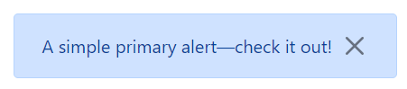

# Alert

This library was generated with [Angular CLI](https://github.com/angular/angular-cli) version 13.2.0.

## Code

`<rds-accordian [id]="id">
  <accordion-item title="Section 1 title" [accordionId]="id">
    <h3>Custom</h3>
  </accordion-item>
  <accordion-item title="Section 2 title" [accordionId]="id">
    <h3>Custom</h3>
  </accordion-item>
</rds-accordian>`

## Options
### Input
<!-- prettier-ignore -->
| Input Name                  | Type                             |Example| Description                                                                  |
| --------------------------- | -------------------------------- |------------| ---------------------------------------------------------------------------- |
| `dismisable`                     | `boolean`                            |"false"|Shows the close button  |
| `alertOpen`           | `boolean`                          | "false"|Used for opening the alert |
| `heading`                   |  `string`                         | "Heading"|Add the heading of the alert|
| `icon`                    | `string` |     ""|Add the Icon for the alert              |
| `position`                | `top`\|`bottom`                           |"bottom"   |Specify the position of the alert
| `size`                | `small`\|`medium`\|`large`                           |"small"   |Specify the size of the alert
| `delay`                | `number`                           |"0"|For adding the delay of the alert     |
| `iconWidth`                | `string`                           |"20px"|Specify the width of the icon     |
| `iconHeight`                | `string`                           |"20px"|Specify the height of the icon     |
| `label`                | `string`                           |"A simple primary alert—check it out!"|For Adding the label for the alert       |
| `type`                | `primary`\|`secondary`\|`success`\|`danger`\|`warning`\|`info`\|`light`\|`dark`|"danger"|For specifing the type of the alert    |
| `showAlertonLoad`                     | `boolean`                            |"false"|Shows the alert on load time  | 
| `visibility`                     | `boolean`                            |"false"|Sets visibility of alert  |   

### Output
| Output Name                 | Type          | Description                     |      
| --------------------------- | --------------|------------------|
| `onDismiss`                 |  `EventEmitter`  | `Emits the Dismiss event`  |
