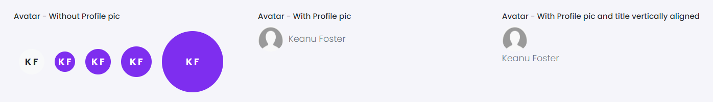

# Avatar

This library was generated with [Angular CLI](https://github.com/angular/angular-cli) version 13.2.0.

## Options
### Input
<!-- prettier-ignore -->
| Input Name                  | Type                             |Example| Description                                                                  |
| --------------------------- | -------------------------------- |------------| ---------------------------------------------------------------------------- |
| `size`                | `small`\|`medium`\|`large`                           |"small"   |Specify the size of the avatar
| `WithProfilePic`                     | `boolean`                            |"true"|To show avatar with a profile picture  |                             |
| `WithUserRole`           | `boolean`                          | "false"|To add user role in avatar |
| `VerticalTitleWithProfilePic`           | `boolean`                          | "false"|To show title vertically below the profile picture |
| `FirstName`                   |  `string`                         | "Keanu"|Add first name for avatar|
| `LastName`                   |  `string`                         | "Foster"|Add last name for avatar|
| `userRole`                    | `string` |     "Admin"|Add the role name of user              |
| `colorVariant`                | `string`                           |"light"   |Specify the color for the avatar
| `Title`                | `string`                           |"Admin"|Title of the avatar     |
| `profilePic`                | `string`                           |"https://th.bing.com/th/id/OIP.3IsXMskZyheEWqtE3Dr7JwHaGe?pid=ImgDet&rs=1"|For adding the profile picture path       |

