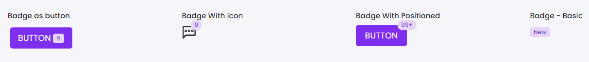

# Badge

This library was generated with [Angular CLI](https://github.com/angular/angular-cli) version 13.2.0.

## Code

`<button type="button" class="btn btn-default" position="bottom" role="basic">
  button
  
    <rds-badge
      size="smallest"
      Types="light"
      label="9"
      [pillBadges]="false"
    ></rds-badge>
  
</button>`

## Options
### Input
<!-- prettier-ignore -->
| Input Name                  | Type                             |Example| Description                                                                  |
| --------------------------- | -------------------------------- |------------| ---------------------------------------------------------------------------- |
| `size`                | `xlg`\|`lg`\|`mid`\|`small`\|`smaller`\|`smallest`                           |"small"   |Specify the size of the badge
| `iconBadge`                     | `boolean`                            |"true"|To show badge as icon  |                             |
| `label`                   |  `string`                         | "New"|Add label name for badge|
| `pillBadges`                   |  `boolean`                         | "false"|Add badge as pills|
| `positioned`                    | `boolean` |     "false"|To set positioned badge              |
| `colorVariant`                |`primary`\|`secondary`\|`success`\|`warning`\|`info`\|`danger`\|`light`\|`dark`\|`white` |"light"   |Specify the color for the avatar

### Output
| Output Name                 | Type          | Description                     |      
| --------------------------- | --------------|------------------|
| `onClick`                 |  `EventEmitter`  | `Emits the Dismiss event`  |

