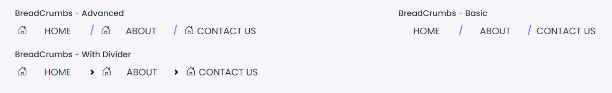

# Breadcrumbs

This library was generated with [Angular CLI](https://github.com/angular/angular-cli) version 13.2.0.

## Code

`<rds-breadcrumb [customBreadcrumbsItems]="customBreadcrumbsItems" role="Advanced" [iconShow]="true" [disabled]="false" (onNavigation)="onNavigation($event)(onItemClick)="onItemClick($event)"></rds-breadcrumb>`

## Options
### Input
<!-- prettier-ignore -->
| Input Name                  | Type                             |Example| Description                                                                  |
| --------------------------- | -------------------------------- |------------| ---------------------------------------------------------------------------- |
| `role`                | `basic`\|`Advanced`\|`withDivider`        |"basic"   |Specify the type of breadcrumb
| `label`                | `string`                           |"A simple primary alert—check it out!"|For Adding the label for the alert       |
| `type`                | `primary`\|`secondary`\|`success`\|`danger`\|`warning`\|`info`\|`light`\|`dark`|"danger"|For specifing the type of the alert    |
| `iconShow`                     | `boolean`                            |"false"  |"Setting icon required or not" |   
|`disabled`|    `boolean`|    "false"|  "For disabling the breadcrumb"
|`customBreadcrumbsItems`|`string`|``|"Sets the breadcrumb items"

### Output
| Output Name                 | Type          | Description                     |      
| --------------------------- | --------------|------------------|
| `onItemClick`                 |  `EventEmitter`  | `Emits the item click event`  |
| `onNavigation`                 |  `EventEmitter`  | `Emits the navigation event`  |
