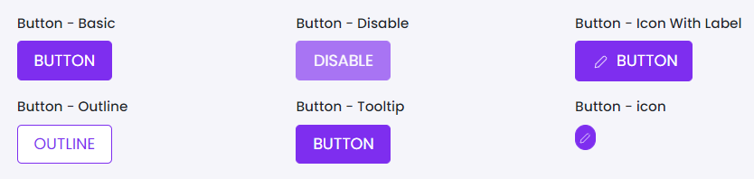

# Button

This library was generated with [Angular CLI](https://github.com/angular/angular-cli) version 13.2.0.

## Code

`<rds-button colorVariant="primary" [submit]="false" [block]="false" size="medium" [disabled]="false" [outlineButton]="false" [roundedButton]="false"  iconHeight="18px" iconWidth="18px" label="button" tooltipTitle="" tooltipPlacement="bottom" id="buttonId" (onClick)="onClick($event)"></rds-button>`

## Options
### Input
<!-- prettier-ignore -->
| Input Name                  | Type                             | Description                                                                  |
| --------------------------- | -------------------------------- | ---------------------------------------------------------------------------- |
| `id`                     | `string`                            |Id of the button  |
| `colorVariant`            | `primary` \| `secondary` \| `danger` | Specify the colour type of the button                                |
| `outlineButton`           | `boolean`                          | Put the otline for the button |
| `label`                   | `string`                           |write the label for the button                            |
| `block`                   |  `boolean`                         | Specify the button is block or not |
| `size`                    | `small` \| `large` \| `medium`     | Specify the size of the button               |
| `disabled`                | `boolean`                           |Spcify the button is diabled or not      |
| `icon`                    | `string`                           |Put the icon names  |
| `iconWidth`               | `pixel`                            |Specify the width of the icon|
| `iconHeight`              | `pixel`                            |Specify the height of the icon  |
| `roundedButton`           | `boolean`                          |Specify the button is rounded or not  |
| `submit`                  | `boolean`                          |Specify the button is submit or not  |
| `tooltipPlacement`        | `top` \| `bottom` \| `right`\|`left` | Specify the position of the tooltip |
| `tooltipTitle`            | `string`                           | write the tooltip string |

### Onput
| Output Name                 | Description                     |      
| --------------------------- | --------------------------------|
| `onClick`                   | `Emit the click of the button`  |

