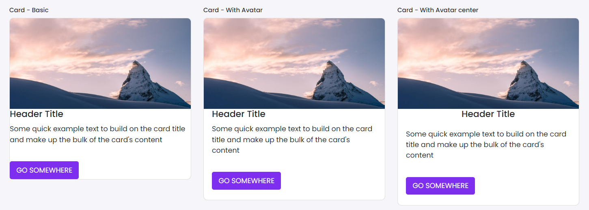

# Card

This library was generated with [Angular CLI](https://github.com/angular/angular-cli) version 13.2.0.

## Code

`<rds-card
  [header]="header"
  [body]="body"
  [footer]="footer"
  [Data]="Data"
  class="rounded-avatar-basic">
  <ng-template #header>
    

      
    

  </ng-template>
  <ng-template #body>
    <h5 class="custom-title">{{Data.headerTitle}}</h5>
    
{{Data.cardDescription}}

  </ng-template>
  <ng-template #footer>
    <a href="#" class="btn btn-primary mt-3">Go somewhere</a>
  </ng-template>
</rds-card>`

## Options
### Input
<!-- prettier-ignore -->
| Input Name                  | Type                             |Example| Description                                                                  |
| --------------------------- | -------------------------------- |------------| ---------------------------------------------------------------------------- |
| `borderCard`           | `boolean`                          | "false"|Specify border required or not |
| `width`                   |  `string`                         | "30%"|Sets width|
| `cardWidth`                | `number`                           |"0"|Specify width of card    |
| `body`                | `TemplateRef<any>`                           |""|Specify the body of the card     |
| `footer`                | `TemplateRef<any>`                           |""|Specify the footer of the card     |
| `header`                | `TemplateRef<any>`                           |""|Specify the header of the card     |
| `Data`                | `any`                           |""| Specify the data of the card     |

