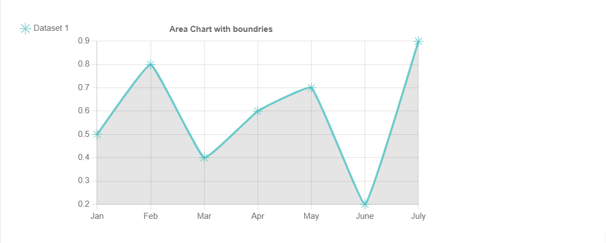

# AreaChart

This library was generated with [Angular CLI](https://github.com/angular/angular-cli) version 13.2.0.

## Code

`<rds-chart-area`  
`  chartId="ChartArea0"`  
`  [chartWidth]="600"`  
`  [chartLabels]="chartLabels"`  
`  [ChartDataSets]="ChartDataSets"`  
`  [chartOptions]="chartOptions"`   
`></rds-chart-area>`  

## Options
### Input
<!-- prettier-ignore -->
| Input Name                  | Type                             |Example| Description                                                                  |
| --------------------------- | -------------------------------- |------------| ---------------------------------------------------------------------------- |
| `ChartDataSets`             | `array list`                  |`[{ "label": "Dataset 1","data":[0.5,0.8,0.40.6,0.7,0.2,0.9],` `"borderColor":"rgba(75,192,192,0.8)","fill": true,"tension": 0.1}]`|Data set of the area chart
| `chartLabels`               | `array`                          | `["Jan","Feb","Mar","Apr","May","June","July"]`|Specify chart labels|
| `chartWidth`                |  `string`                       | "200"|Specify the width of the chart|
| `chartOptions`                |  `array of object`                       | `{"pointStyle":"star","radius":7,"responsive":true,"plugins":{"legend":{"position":"left","align":"start","pointStyle":"bottom","labels":{"usePointStyle":true}},"tooltip":{"usePointStyle":true},"filler":{"propagate":false},"title":{"display":true,"text":"Area Chart with boundries"}},"interaction":{"intersect":false}}`|Specify the various options of the chart|

