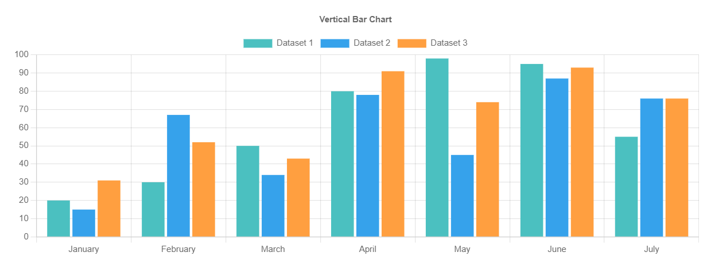

# HorizontalBarChart

This library was generated with [Angular CLI](https://github.com/angular/angular-cli) version 13.2.0.

## Code

`<rds-chart-bar-horizontal`  
 ` chartId="horizontalChart0"`  
 ` [chartWidth]="100"`  
 ` [chartHeight]="350"`  
 ` [chartLabels]="chartLabels"`  
 ` [ChartDataSets]="ChartDataSets"`  
 ` [chartOptions]="chartOptions"`  
`></rds-chart-bar-horizontal> `  

## Options
### Input
<!-- prettier-ignore -->
| Input Name                  | Type                             |Example| Description                                                                  |
| --------------------------- | -------------------------------- |------------| ---------------------------------------------------------------------------- |
| `ChartDataSets`             | `array list`        |`[{"label": "Fully Rounded","data": [20,30,50,80,98,95,55],"backgroundColor": "rgba(75, 192, 192,` `1)","borderColor": "rgba(75, 192, 192, 1)","borderWidth": 2,"borderRadius": 1.7976931348623157e+308,"borderSkipped": false},{"label": "Small` `Radius","data[15,67,34,78,45,87,76],"backgroundColor": "rgba(54, 162, 235, 1)","borderColor": "rgba(54, 162, 245, 1)","borderWidth":` `2,"borderRadius":5,"borderSkipped": false}]`|Data set of the area chart`
| `chartLabels`               | `array`                          | `["Jan","Feb","Mar","Apr","May","June","July"]`|Specify chart labels|
| `chartWidth`                |  `string`                       | "200"|Specify the width of the chart|
| `chartHeight`                |  `number`                       | "200"|Specify the width of the chart|
| `chartId`                |  `string`                       | "chartid"|Specify the ID of the chart|
| `chartStyle`                |  `Dark`\|`light`                       | "Dark"|Specify the style of the chart|
| `chartOptions`                |  `array of object`                       | `{"maintainAspectRatio":false,"indexAxis":"y","elements":{"bar":{"borderWidth":0}},"plugins":{"legend":{"position":"right","pointStyle":"line","labels":{"usePointStyle":true}},"tooltip":{"usePointStyle":true},"title":{"display":true,"text":"Horizontal Bar Chart"}}}`|Specify the various options of the chart|

