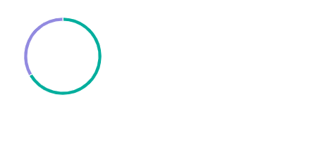

# BoolChart

This library was generated with [Angular CLI](https://github.com/angular/angular-cli) version 13.2.0.

## Code

`<rds-chart-bool`  
 ` chartId="mychart0"`  
 ` [chartWidth]="300"`  
`  [chartHeight]="400"`  
`  [chartLabels]="chartLabels"`  
`  [ChartDataSets]="ChartDataSets"`  
`  chartType="doughnut"`  
`  [chartOptions]="chartOptions"`  
`></rds-chart-bool>`  

## Options
### Input
<!-- prettier-ignore -->
| Input Name                  | Type                             |Example| Description                                                                  |
| --------------------------- | -------------------------------- |------------| ---------------------------------------------------------------------------- |
| `ChartDataSets`             | `array list`        |`[{"label":"Dataset 1","data":[20,10],"fillStyle":"blue","fillRect":[200,100,40,10],"backgroundColor":["#01AE9D","#E1E1E1"],"borderColor":["#fff"],"borderWidth":1,"cutout":"90%","title":{"text":"Doughnut Chart","verticalAlign":"center","dockInsidePlotArea":true}}]`|Data set of the Bool Chart
| `chartLabels`               | `array`                          | `["green","grey"]`|Specify chart labels|
| `chartWidth`                |  `string`                       | "200"|Specify the width of the chart|
| `chartHeight`                |  `number`                       | "200"|Specify the width of the chart|
| `chartId`                |  `string`                       | "chartid"|Specify the ID of the chart|
| `chartStyle`                |  `Dark`\|`light`                       | "Dark"|Specify the style of the chart|
|`chartOptions`|`array object`|`{"elements":{"center":{"text":"50%"}},"cutoutPercentage":75,"legend":{"display":false},"responsive":true,"plugins":{"series":{"label":{"position":"inside","text":"total","display":false}},"doughnutlabel":{"labels":[{"text":"550","font":{"size":20,"weight":"bold"}},{"text":"total"}]},"legend":{"display":false,"align":"start","position":"right"}},"scales":{}}`|Specify the options of the chart|
