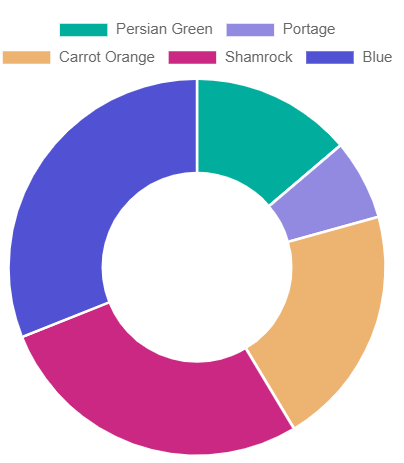

# DoughnutChart

This library was generated with [Angular CLI](https://github.com/angular/angular-cli) version 13.2.0.

## Code

`<rds-chart-doughnut`  
  `chartId="doughnutChart0"`  
 ` [chartWidth]="300"`  
 ` [chartHeight]="400"`  
 ` [chartLabels]="chartLabels"`  
 ` [ChartDataSets]="ChartDataSets"`  
 ` [chartOptions]="chartOptions"`  
`></rds-chart-doughnut>`  

## Options
### Input
<!-- prettier-ignore -->
| Input Name                  | Type                             |Example| Description                                                                  |
| --------------------------- | -------------------------------- |------------| ---------------------------------------------------------------------------- |
| `ChartDataSets`             | `array list`        |`[{"label":"Dataset 1","data":[20,10,30,40],"backgroundColor":["#ff6384","#ff9f40","#ffcd56","#4bc0c0"],"borderColor":["#fff"]}]`|Data set of the Doughnut Chart
| `chartLabels`               | `array`                          | `["Red","Orange","Yellow","Green","Blue"]`|Specify chart labels|
| `chartWidth`                |  `string`                       | "200"|Specify the width of the chart|
| `chartHeight`                |  `number`                       | "200"|Specify the width of the chart|
| `chartId`                |  `string`                       | "chartid"|Specify the ID of the chart|
| `chartStyle`                |  `Dark`\|`light`                       | "Dark"|Specify the style of the chart|
|`chartOptions`|`Object`|`{"maintainAspectRatio":false,"type":"doughnut","options":{"responsive":true,"maintainAspectRatio":false,"plugins":{"legend":{"position":"top"},"title":{"display":true,"text":"Chart.js Doughnut Chart"}}},"plugins":{},"scales":{}}`|Chart options|

