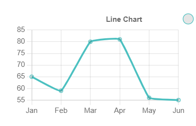

# LineChart

This library was generated with [Angular CLI](https://github.com/angular/angular-cli) version 13.2.0.

## Code

`<rds-chart-line`  
 ` chartId="lineChart0"`  
`  [chartWidth]="600"`  
`  [chartHeight]="400"`  
`  [chartLabels]="chartLabels"`  
`  [ChartDataSets]="ChartDataSets"`  
`  [chartOptions]="chartOptions"`  
`></rds-chart-line>`  

## Options
### Input
<!-- prettier-ignore -->
| Input Name                  | Type                             |Example| Description                                                                  |
| --------------------------- | -------------------------------- |------------| ---------------------------------------------------------------------------- |
| `ChartDataSets`             | `array list`        |`[{"label":"My First Dataset","data":[65,59,80,81,56,55],"fill":false,"borderColor":"rgb(75, 192, 192)","tension":0.1}]`|Data set of the Line Chart
| `chartLabels`               | `array`                          | `["Jan","Feb","Mar","Apr","May","Jun"]`|Specify chart labels|
| `chartWidth`                |  `string`                       | "200"|Specify the width of the chart|
| `chartHeight`                |  `number`                       | "200"|Specify the width of the chart|
| `chartId`                |  `string`                       | "chartid"|Specify the ID of the chart|
| `chartStyle`                |  `Dark`\|`light`                       | "Dark"|Specify the style of the chart|
|`chartOptions`|`Object`|`{"responsive":true,"maintainAspectRatio":false,"plugins":{"legend":{"position":"right","align":"start","pointStyle":"line","labels":{"usePointStyle":true}},"tooltip":{"usePointStyle":true},"title":{"display":true,"text":"Line Chart","Position":"left","align":"center","color":"#666"}},"scales":{"x":{"axis":"x","ticks":{"color":"#666","minRotation":0,"maxRotation":50,"mirror":false,"textStrokeWidth":0,"textStrokeColor":"","padding":3,"display":true,"autoSkip":true,"autoSkipPadding":3,"labelOffset":0,"minor":{},"major":{},"align":"center","crossAlign":"near","showLabelBackdrop":false,"backdropColor":"rgba(255, 255, 255, 0.75)","backdropPadding":2},"type":"category","display":true,"offset":false,"reverse":false,"beginAtZero":false,"bounds":"ticks","grace":0,"grid":{"display":true,"lineWidth":1,"drawBorder":true,"drawOnChartArea":true,"drawTicks":true,"tickLength":8,"offset":false,"borderDash":[],"borderDashOffset":0,"borderWidth":1,"color":"rgba(0,0,0,0.1)","borderColor":"rgba(0,0,0,0.1)"},"title":{"display":false,"text":"","padding":{"top":4,"bottom":4},"color":"#666"},"id":"x","position":"bottom"},"y":{"axis":"y","ticks":{"color":"#666","minRotation":0,"maxRotation":50,"mirror":false,"textStrokeWidth":0,"textStrokeColor":"","padding":3,"display":true,"autoSkip":true,"autoSkipPadding":3,"labelOffset":0,"minor":{},"major":{},"align":"center","crossAlign":"near","showLabelBackdrop":false,"backdropColor":"rgba(255, 255, 255, 0.75)","backdropPadding":2},"type":"linear","display":true,"offset":false,"reverse":false,"beginAtZero":false,"bounds":"ticks","grace":0,"grid":{"display":true,"lineWidth":1,"drawBorder":true,"drawOnChartArea":true,"drawTicks":true,"tickLength":8,"offset":false,"borderDash":[],"borderDashOffset":0,"borderWidth":1,"color":"rgba(0,0,0,0.1)","borderColor":"rgba(0,0,0,0.1)"},"title":{"display":false,"text":"","padding":{"top":4,"bottom":4},"color":"#666"},"id":"y","position":"left"}}}`|Chart options|
