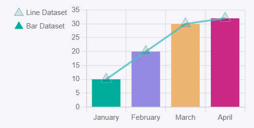

# MixedChart

This library was generated with [Angular CLI](https://github.com/angular/angular-cli) version 13.2.0.

## Code

`<rds-chart-mixed`  
 ` chartId="mixedchart0"`  
 ` [chartWidth]="500"`  
 ` [chartLabels]="chartLabels"`  
 ` [ChartDataSets]="ChartDataSets"`  
 ` [chartOptions]="chartOptions"`  
`></rds-chart-mixed>`  

## Options
### Input
<!-- prettier-ignore -->
| Input Name                  | Type                             |Example| Description                                                                  |
| --------------------------- | -------------------------------- |------------| ---------------------------------------------------------------------------- |
| `ChartDataSets`             | `array list`        |`[{"type":"bar","label":"Bar Dataset","data":[10,20,30,32],"backgroundColor":["orange"],"order":2},{"type":"line","label":"Line Dataset","data":[10,20,30,32],"borderColor":"rgba(75, 192, 192, 0.8)","order":1}]`|Data set of the area chart`
| `chartLabels`               | `array`                          | `["Jan","Feb","Mar","Apr"]`|Specify chart labels|
| `chartWidth`                |  `string`                       | "200"|Specify the width of the chart|
| `chartHeight`                |  `number`                       | "200"|Specify the width of the chart|
| `chartId`                |  `string`                       | "chartid"|Specify the ID of the chart|
| `chartStyle`                |  `Dark`\|`light`                       | "Dark"|Specify the style of the chart|
|`chartOptions`|`Object`|`{"radius":10,"pointStyle":"triangle","plugins":{"legend":{"position":"left","align":"start","pointStyle":"bottom","labels":{"usePointStyle":true}},"tooltip":{"usePointStyle":true}},"responsive":true,"scales":{"y":{"axis":"y","beginAtZero":true,"type":"linear","ticks":{"minRotation":0,"maxRotation":50,"mirror":false,"textStrokeWidth":0,"textStrokeColor":"","padding":3,"display":true,"autoSkip":true,"autoSkipPadding":3,"labelOffset":0,"minor":{},"major":{},"align":"center","crossAlign":"near","showLabelBackdrop":false,"backdropColor":"rgba(255, 255, 255, 0.75)","backdropPadding":2,"color":"#666"},"display":true,"offset":false,"reverse":false,"bounds":"ticks","grace":0,"grid":{"display":true,"lineWidth":1,"drawBorder":true,"drawOnChartArea":true,"drawTicks":true,"tickLength":8,"offset":false,"borderDash":[],"borderDashOffset":0,"borderWidth":1,"color":"rgba(0,0,0,0.1)","borderColor":"rgba(0,0,0,0.1)"},"title":{"display":false,"text":"","padding":{"top":4,"bottom":4},"color":"#666"},"id":"y","position":"left"},"x":{"axis":"x","type":"category","offset":true,"grid":{"offset":true,"display":true,"lineWidth":1,"drawBorder":true,"drawOnChartArea":true,"drawTicks":true,"tickLength":8,"borderDash":[],"borderDashOffset":0,"borderWidth":1,"color":"rgba(0,0,0,0.1)","borderColor":"rgba(0,0,0,0.1)"},"ticks":{"minRotation":0,"maxRotation":50,"mirror":false,"textStrokeWidth":0,"textStrokeColor":"","padding":3,"display":true,"autoSkip":true,"autoSkipPadding":3,"labelOffset":0,"minor":{},"major":{},"align":"center","crossAlign":"near","showLabelBackdrop":false,"backdropColor":"rgba(255, 255, 255, 0.75)","backdropPadding":2,"color":"#666"},"display":true,"reverse":false,"beginAtZero":false,"bounds":"ticks","grace":0,"title":{"display":false,"text":"","padding":{"top":4,"bottom":4},"color":"#666"},"id":"x","position":"bottom"}}}`|Chart options|
