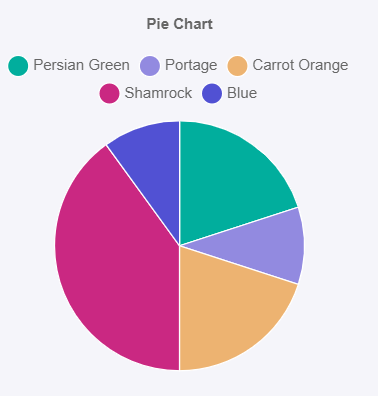

# PieChart

This library was generated with [Angular CLI](https://github.com/angular/angular-cli) version 13.2.0.

## Code

`<rds-chart-pie`  
`  chartId="pieChart0"`  
 ` [chartWidth]="300"`  
`  [chartLabels]="chartLabels"`  
`  [ChartDataSets]="ChartDataSets"`  
 ` [chartOptions]="chartOptions"`  
`></rds-chart-pie>`  

## Options
### Input
<!-- prettier-ignore -->
| Input Name                  | Type                             |Example| Description                                                                  |
| --------------------------- | -------------------------------- |------------| ---------------------------------------------------------------------------- |
| `ChartDataSets`             | `array list`        |`[{"label":"Dataset1","data":[20,10,20,40,10],"backgroundColor":["#ff6384","#ff9f40","#ffcd56","#4bc0c0","#059bff"],"borderColor":["#fff"],"borderWidth":1}]`|Data set of the Pie Chart`
| `chartLabels`               | `array`                          | `["Jan","Feb","Mar","Apr"]`|Specify chart labels|
| `chartWidth`                |  `string`                       | "200"|Specify the width of the chart|
| `chartHeight`                |  `number`                       | "200"|Specify the width of the chart|
| `chartId`                |  `string`                       | "chartid"|Specify the ID of the chart|
| `chartStyle`                |  `Dark`\|`light`                       | "Dark"|Specify the style of the chart|
|`chartOptions`|`Object`|`{"circumference":360,"radius":100,"animation":{"animateRotate":false,"animateScale":true},"responsive":true,"plugins":{"legend":{"position":"top","pointStyle":"line","labels":{"usePointStyle":true}},"title":{"display":true,"text":"Pie Chart"}},"scales":{}}`|Chart options|
