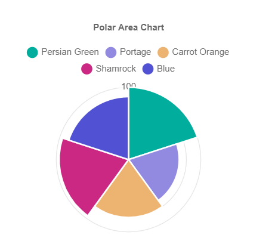

# PolarAreaChart

This library was generated with [Angular CLI](https://github.com/angular/angular-cli) version 13.2.0.

## Code

`<rds-chart-polar-area`    
  `chartId="polarAreaChart0"`  
  `[chartWidth]="400"`  
 ` [chartLabels]="chartLabels"`  
 ` [ChartDataSets]="ChartDataSets"`  
 ` [chartOptions]="chartOptions"`  
`></rds-chart-polar-area> `  

## Options
### Input
<!-- prettier-ignore -->
| Input Name                  | Type                             |Example| Description                                                                  |
| --------------------------- | -------------------------------- |------------| ---------------------------------------------------------------------------- |
| `ChartDataSets`             | `array list`        |`[{"label":"Dataset 1","data":[100,70,80,96,87,77],"backgroundColor":["rgba(255, 99, 132, 0.2)","rgba(54, 162, 235, 0.2)","rgba(255, 206, 86, 0.2)","rgba(75, 192, 192, 0.2)","rgba(153, 102, 255, 0.2)","rgba(167, 145, 78, 0.2)"],"borderColor":["#fff"]}]`|Data set of the PolarAreChart
| `chartLabels`               | `array`                          | `["Jan","Feb","Mar","Apr"]`|Specify chart labels|
| `chartWidth`                |  `string`                       | "200"|Specify the width of the chart|
| `chartHeight`                |  `number`                       | "200"|Specify the width of the chart|
| `chartId`                |  `string`                       | "chartid"|Specify the ID of the chart|
| `chartStyle`                |  `Dark`\|`light`                       | "Dark"|Specify the style of the chart|
|`chartOptions`|`Object`|`{"animation":{"animateRotate":true,"animateScale":false},"responsive":true,"plugins":{"legend":{"position":"top","pointStyle":"line","labels":{"usePointStyle":true}},"tooltip":{"usePointStyle":true},"title":{"display":true,"text":"Polar Area Chart"}},"scales":{"r":{"axis":"r","type":"radialLinear","angleLines":{"display":false,"lineWidth":1,"borderDash":[],"borderDashOffset":0,"color":"rgba(0,0,0,0.1)"},"beginAtZero":true,"grid":{"circular":true,"display":true,"lineWidth":1,"drawBorder":true,"drawOnChartArea":true,"drawTicks":true,"tickLength":8,"offset":false,"borderDash":[],"borderDashOffset":0,"borderWidth":1,"color":"rgba(0,0,0,0.1)","borderColor":"rgba(0,0,0,0.1)"},"pointLabels":{"display":false,"backdropPadding":2,"font":{"size":10},"padding":5,"centerPointLabels":false,"color":"#666"},"startAngle":0,"display":true,"animate":true,"position":"chartArea","ticks":{"showLabelBackdrop":true,"color":"#666","minRotation":0,"maxRotation":50,"mirror":false,"textStrokeWidth":0,"textStrokeColor":"","padding":3,"display":true,"autoSkip":true,"autoSkipPadding":3,"labelOffset":0,"minor":{},"major":{},"align":"center","crossAlign":"near","backdropColor":"rgba(255, 255, 255, 0.75)","backdropPadding":2},"offset":false,"reverse":false,"bounds":"ticks","grace":0,"title":{"display":false,"text":"","padding":{"top":4,"bottom":4},"color":"#666"},"id":"r"}}}`|Chart options|
