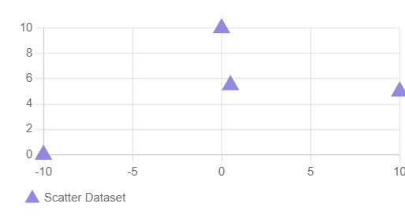

# ScatterChart

This library was generated with [Angular CLI](https://github.com/angular/angular-cli) version 13.2.0.

## Code

`<rds-chart-scatter`  
  `chartId="scatterChart0"`  
  `[chartWidth]="500"`  
 ` [chartLabels]="chartLabels"`  
 ` [ChartDataSets]="ChartDataSets"`  
 ` [chartOptions]="chartOptions"`  
`></rds-chart-scatter>`  

## Options
### Input
<!-- prettier-ignore -->
| Input Name                  | Type                             |Example| Description                                                                  |
| --------------------------- | -------------------------------- |------------| ---------------------------------------------------------------------------- |
| `ChartDataSets`             | `array list`        |`[{"type":"scatter","label":"Scatter Dataset","data":[{"x":-10,"y":0},{"x":0,"y":10},{"x":10,"y":5},{"x":0.5,"y":5.5}],"backgroundColor":"rgb(255, 99, 132)"}]`|Data set of the Scatter Chart
| `chartLabels`               | `array`                          | `["Jan","Feb","Mar","Apr"]`|Specify chart labels|
| `chartWidth`                |  `string`                       | "200"|Specify the width of the chart|
| `chartHeight`                |  `number`                       | "200"|Specify the width of the chart|
| `chartId`                |  `string`                       | "chartid"|Specify the ID of the chart|
| `chartStyle`                |  `Dark`\|`light`                       | "Dark"|Specify the style of the chart|
|`chartOptions`|`Object`|`{"pointStyle":"triangle","radius":10,"plugins":{"legend":{"position":"bottom","align":"start","pointStyle":"line","labels":{"usePointStyle":true}},"tooltip":{"usePointStyle":true}},"scales":{"x":{"axis":"x","type":"linear","position":"bottom","ticks":{"minRotation":0,"maxRotation":50,"mirror":false,"textStrokeWidth":0,"textStrokeColor":"","padding":3,"display":true,"autoSkip":true,"autoSkipPadding":3,"labelOffset":0,"minor":{},"major":{},"align":"center","crossAlign":"near","showLabelBackdrop":false,"backdropColor":"rgba(255, 255, 255, 0.75)","backdropPadding":2,"color":"#666"},"display":true,"offset":false,"reverse":false,"beginAtZero":false,"bounds":"ticks","grace":0,"grid":{"display":true,"lineWidth":1,"drawBorder":true,"drawOnChartArea":true,"drawTicks":true,"tickLength":8,"offset":false,"borderDash":[],"borderDashOffset":0,"borderWidth":1,"color":"rgba(0,0,0,0.1)","borderColor":"rgba(0,0,0,0.1)"},"title":{"display":false,"text":"","padding":{"top":4,"bottom":4},"color":"#666"},"id":"x"},"y":{"axis":"y","type":"linear","ticks":{"minRotation":0,"maxRotation":50,"mirror":false,"textStrokeWidth":0,"textStrokeColor":"","padding":3,"display":true,"autoSkip":true,"autoSkipPadding":3,"labelOffset":0,"minor":{},"major":{},"align":"center","crossAlign":"near","showLabelBackdrop":false,"backdropColor":"rgba(255, 255, 255, 0.75)","backdropPadding":2,"color":"#666"},"display":true,"offset":false,"reverse":false,"beginAtZero":false,"bounds":"ticks","grace":0,"grid":{"display":true,"lineWidth":1,"drawBorder":true,"drawOnChartArea":true,"drawTicks":true,"tickLength":8,"offset":false,"borderDash":[],"borderDashOffset":0,"borderWidth":1,"color":"rgba(0,0,0,0.1)","borderColor":"rgba(0,0,0,0.1)"},"title":{"display":false,"text":"","padding":{"top":4,"bottom":4},"color":"#666"},"id":"y","position":"left"}}}`|Chart options|
