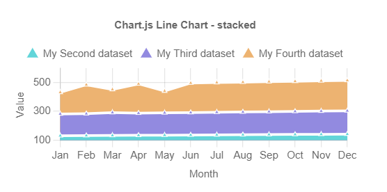

# StackedChart

This library was generated with [Angular CLI](https://github.com/angular/angular-cli) version 13.2.0.

## Code

`<rds-chart-stacked`  
 ` chartId="stackChart0"`  
  `[chartWidth]="1000"`  
  `[chartLabels]="chartLabels"`  
  `[ChartDataSets]="ChartDataSets"`  
  `[chartOptions]="chartOptions"`  
`></rds-chart-stacked>`  

## Options
### Input
<!-- prettier-ignore -->
| Input Name                  | Type                             |Example| Description                                                                  |
| --------------------------- | -------------------------------- |------------| ---------------------------------------------------------------------------- |
| `ChartDataSets`             | `array list`        |`[{"label":"My Second dataset","data":[131,132,133,134,135,136,137,138,139,140,141,142],"borderColor":"white","backgroundColor":"#62D5D9","fill":true},{"label":"My Third dataset","data":[151,152,159,154,155,156,157,158,159,160,161,162],"borderColor":"white","backgroundColor":"#928AE0","fill":true},{"label":"My Fourth dataset","data":[150,201,160,203,151,205,206,207,208,209,210,211],"borderColor":"white","backgroundColor":"#EDB371","fill":true}]`|Data set of the Stacked Chart 
| `chartLabels`               | `array`                          | `["Jan","Feb","Mar","Apr","May","Jun","Jul","Aug","Sep","Oct","Nov","Dec"]`|Specify chart labels|
| `chartWidth`                |  `string`                       | "200"|Specify the width of the chart|
| `chartHeight`                |  `number`                       | "200"|Specify the width of the chart|
| `chartId`                |  `string`                       | "chartid"|Specify the ID of the chart|
| `chartStyle`                |  `Dark`\|`light`                       | "Dark"|Specify the style of the chart|
|`chartOptions`|`Object`|`{"radius":3,"pointStyle":"triangle","plugins":{"title":{"display":true,"text":"Chart.js Line Chart - stacked"},"tooltip":{"mode":"index"},"legend":{"pointStyle":"circle","labels":{"usePointStyle":true},"tooltip":{"usePointStyle":true}}},"interaction":{"mode":"nearest","axis":"x","intersect":false},"scales":{"x":{"axis":"x","title":{"display":true,"text":"Month","padding":{"top":4,"bottom":4},"color":"#666"},"type":"category","ticks":{"minRotation":0,"maxRotation":50,"mirror":false,"textStrokeWidth":0,"textStrokeColor":"","padding":3,"display":true,"autoSkip":true,"autoSkipPadding":3,"labelOffset":0,"minor":{},"major":{},"align":"center","crossAlign":"near","showLabelBackdrop":false,"backdropColor":"rgba(255, 255, 255, 0.75)","backdropPadding":2,"color":"#666"},"display":true,"offset":false,"reverse":false,"beginAtZero":false,"bounds":"ticks","grace":0,"grid":{"display":true,"lineWidth":1,"drawBorder":true,"drawOnChartArea":true,"drawTicks":true,"tickLength":8,"offset":false,"borderDash":[],"borderDashOffset":0,"borderWidth":1,"color":"rgba(0,0,0,0.1)","borderColor":"rgba(0,0,0,0.1)"},"id":"x","position":"bottom"},"y":{"axis":"y","stacked":true,"title":{"display":true,"text":"Value","padding":{"top":4,"bottom":4},"color":"#666"},"type":"linear","ticks":{"minRotation":0,"maxRotation":50,"mirror":false,"textStrokeWidth":0,"textStrokeColor":"","padding":3,"display":true,"autoSkip":true,"autoSkipPadding":3,"labelOffset":0,"minor":{},"major":{},"align":"center","crossAlign":"near","showLabelBackdrop":false,"backdropColor":"rgba(255, 255, 255, 0.75)","backdropPadding":2,"color":"#666"},"display":true,"offset":false,"reverse":false,"beginAtZero":false,"bounds":"ticks","grace":0,"grid":{"display":true,"lineWidth":1,"drawBorder":true,"drawOnChartArea":true,"drawTicks":true,"tickLength":8,"offset":false,"borderDash":[],"borderDashOffset":0,"borderWidth":1,"color":"rgba(0,0,0,0.1)","borderColor":"rgba(0,0,0,0.1)"},"id":"y","position":"left"}}}`|Chart options|
