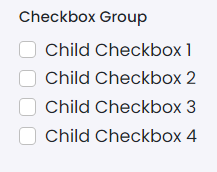

# Checkbox Group

This library was generated with [Angular CLI](https://github.com/angular/angular-cli) version 13.2.0.

## Code

`<rds-checkbox-groups
  [checked]="false"
  [disabled]="false"
  [switch]="false"
  [inline]="false"
  [withLabel]="true"
  [isInputGroup]="false"
  [itemList]="itemList"
  state="checkbox"
  (onCheck)="onCheck($event)"
  (onUncheck)="onUncheck($event)"
  (onClick)="onClick($event)"></rds-checkbox-groups>`
  
## Options
### Input
<!-- prettier-ignore -->
| Input Name                  | Type                             |Example| Description                                                                  |
| --------------------------- | -------------------------------- |------------| ---------------------------------------------------------------------------- |
| `itemList`                     | `any`    |`[{'id': 1,'label': 'Child Checkbox 1'},{'id': 2,'label': 'Child Checkbox 2'},{'id': 3,'label': 'Child Checkbox 3'},{  'id': 4,'label': 'Child Checkbox 4'}]`|Shows the close button  |
| `withLabel`           | `boolean`                          | "true"|Specify label to be shown or not|
| `checked`                     | `boolean`                            |"false"|Specify checkbox to be checked or not by default  | 
| `disabled`                     | `boolean`                            |"false"|Specify disable the checkbox or not |  
| `inline`                     | `boolean`                            |"false"|Specify items to be shown as in line |  
|`id`|`string`|"checkboxid"|Specify the id |
|`label`|`string`|"checkboxid"|Specify the label |
|`state`|`checkbox`\|`Indeterminate`\|`errorcheckbox`    |"checkbox"|Specify the type of checkbox |
| `isInputGroup`                     | `boolean`                            |"false"|Specify whether using as input group or not | 
| `switch`                     | `boolean`                            |"false"|Specify switch type checkbox or not | 

### Output
| Output Name                 | Type          | Description                     |      
| --------------------------- | --------------|------------------|
| `onCheck`                 |  `EventEmitter`  | `Emits the check event`  |
| `onUncheck`                 |  `EventEmitter`  | `Emits the uncheck event`  |
| `onClick`                 |  `EventEmitter`  | `Emits the click event`  |
