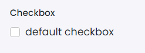

# Checkbox

This library was generated with [Angular CLI](https://github.com/angular/angular-cli) version 13.2.0.

## Code

`<rds-checkbox
  label="default checkbox"
  [checked]="false"
  [disabled]="false"
  [switch]="false"
  [inline]="false"
  id="checkboxid"
  [withLabel]="true"
  [isInputGroup]="false"
  state="checkbox"
  (onClick)="onClick($event)"
  (onChange)="onChange($event)"></rds-checkbox>`
  
## Options
### Input
<!-- prettier-ignore -->
| Input Name                  | Type                             |Example| Description                                                                  |
| --------------------------- | -------------------------------- |------------| ---------------------------------------------------------------------------- |
| `withLabel`           | `boolean`                          | "true"|Specify label to be shown or not|
| `checked`                     | `boolean`                            |"false"|Specify checkbox to be checked or not by default  | 
| `disabled`                     | `boolean`                            |"false"|Specify disable the checkbox or not |  
| `inline`                     | `boolean`                            |"false"|Specify items to be shown as in line |  
|`id`|`string`|"checkboxid"|Specify the id |
|`label`|`string`|"checkboxid"|Specify the label |
|`state`|`checkbox`\|`Indeterminate`\|`errorcheckbox`    |"checkbox"|Specify the type of checkbox |
| `isInputGroup`                     | `boolean`                            |"false"|Specify whether using as input group or not | 
| `switch`                     | `boolean`                            |"false"|Specify switch type checkbox or not | 

### Output
| Output Name                 | Type          | Description                     |      
| --------------------------- | --------------|------------------|
| `onChange`                 |  `EventEmitter`  | `Emits the check value`  |
| `onClick`                 |  `EventEmitter`  | `Emits the click event`  |
