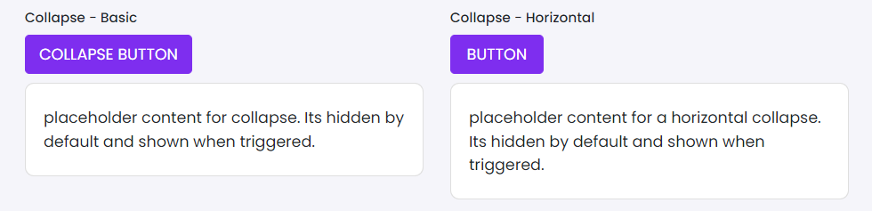

# Collapse

This library was generated with [Angular CLI](https://github.com/angular/angular-cli) version 13.2.0.

## Code

`<rds-collapse
  collapseId="collapseExample4"
  label="collapse button"
  content="placeholder content for collapse. Its hidden by default and shown when triggered."
  (toggle)="toggle($event)"
  (onClose)="onClose($event)"
  (onShow)="onShow($event)"></rds-collapse>`
  
## Options
### Input
<!-- prettier-ignore -->
| Input Name                  | Type                             |Example| Description                                                                  |
| --------------------------- | -------------------------------- |------------| ---------------------------------------------------------------------------- |
| `collapseId`                   |  `string`                    |"collapseExample"     | Specify id of the collapse|
| `colorVariant`                | `primary`\|`secondary`\|`success`\|`danger`\|`warning`\|`info`\|`light`\|`dark`|"danger"|For specifing the type of the alert    |
| `content`                | `string`                           |"This is some placeholder content for a horizontal collapse. Its hidden by default and shown when triggered."    |For Adding content to collapse |
| `Horizontal`           | `boolean`                          | "false"   |Used for opening the collapse horizontally |
| `label`                   |  `string`                    |"Collapse Button"     | Specify label for the collapsing button|
| `width`                   |  `string`                     |"300px"    | Specify width of the collapse|

### Output
| Output Name                 | Type          | Description                     |      
| --------------------------- | --------------|------------------|
| `onClose`                 |  `EventEmitter`  | `Emits event on close`  |
| `onShow`                 |  `EventEmitter`  | `Emits event on Show`  |
