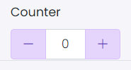

# Counter

This library was generated with [Angular CLI](https://github.com/angular/angular-cli) version 13.2.0.

## Code

`<rds-counter
  [counterValue]="0"
  Title=""
  label=""
  [min]="0"
  [max]="40"
  [width]="124"
  colorVariant="primary"
  (counterChange)="counterChange($event)"></rds-counter>`
  
## Options
### Input
<!-- prettier-ignore -->
| Input Name                  | Type                             |Example| Description                                                                  |
| --------------------------- | -------------------------------- |------------| ---------------------------------------------------------------------------- |
| `Title`                   |  `string`                         | "Counter"|Add the title of the counter|
| `label`                | `string`                           |"Counter"|For Adding the label for the counter       |
| `colorVariant`                | `primary`\|`secondary`\|`success`\|`danger`\|`warning`\|`info`\|`light`\|`dark`|"danger"|For specifing the type of the counter    |
| `counterValue`                     | `number`                            |"false"|Shows the alert on load time  | 
| `width`                     | `number`                            |"false"|Sets visibility of alert  |   
| `max`                | `number`                           |"40"|Specify the maximum value for counter     |
| `min`                | `number`                           |"0"|Specify the minimum value for counter |

### Output
| Output Name                 | Type          | Description                     |      
| --------------------------- | --------------|------------------|
| `counterChange`                 |  `EventEmitter`  | `Emits the event on changing counter value`  |
