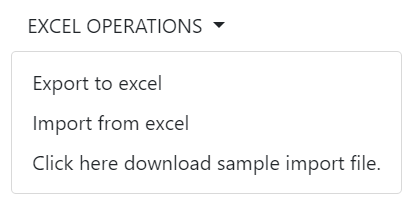

# Dropdown

This library was generated with [Angular CLI](https://github.com/angular/angular-cli) version 13.2.0.

## Code
`<rds-dropdown [listItems]="listItems" label="EXCEL OPERATIONS" size="default" role="dropdown-button" dropdownStyle="btn-secondary"(click)="onclick($event,item)"`
`></rds-dropdown>`

## Options
### Input
<!-- prettier-ignore -->
| Input Name                  | Type                             |Example| Description                                                                  |
| --------------------------- | -------------------------------- |------------| ---------------------------------------------------------------------------- |
| `colorVariant`                | `primary`\|`secondary`\|`success`\|`danger`\|`warning`\|`info`\|`light`\|`dark`|"danger"|For specifing the color of dropdown    |
| `size`                | `default`\|`small`\|`large`                           |"small"   |Specify the size of the dropdown
| `darkDropdown`        | `boolean`                            |"false"|Specify dark mode  |
| `listItems`           | `{}`                          | `[ { value: 'Export to excel', some: 'value', id: 1, href: '', icon: 'circle', iconWidth: '20px', iconHeight: '20px', color: 'primary' }, { value: 'Import from excel', some: 'value', id: 2, href: '', icon: 'download-collected-data', iconWidth: '20px', iconHeight: '20px', color: 'primary' }, { value: 'Click here download sample import file.', some: 'value', id: 3, href: '', icon: '', iconWidth: '', iconHeight: '', color: 'primary' }, ]` |Specify the dropdown items |
| `direction`                | `Drop-down`\|`Drop-up`\|`Drop-start`\|`Drop-end`    |"Drop-down"   |Specify the position of dropdown list
| `label`                | `string`      |"A simple primary alert—check it out!"|For Adding the label for the alert       |
| `dropdownAlignment`      | `string[]`        |`[]`| specify dropdown alignment
| `role`             | `dropdown-button`\|`with_split`                 |"dropdown-button"   |Specify the type of the dropdown

### Output
| Output Name                 | Type          | Description                     |      
| --------------------------- | --------------|------------------|
| `onSelect`                 |  `EventEmitter`  | `Emits the selected item event`
