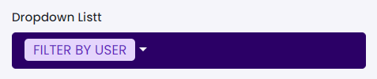

# Dropdown List

This library was generated with [Angular CLI](https://github.com/angular/angular-cli) version 13.2.0.

## Code
`<rds-dropdownlist [DropdownItems]="DropdownItems" [listItems]="listItems" size="default" colorVariant="btn-secondary">`
`<ng-template #DropdownItems let-val let-index="index"><li [class.active]="index === 1">`
`
`
`<input type="checkbox" *ngIf="multiSelect" />`   
``
`{{val.some}} 
</li></ng-template>`
`</rds-dropdownlist>`

## Options
### Input
<!-- prettier-ignore -->
| Input Name                  | Type                             |Example| Description                                                                  |
| --------------------------- | -------------------------------- |------------| ---------------------------------------------------------------------------- |
| `colorVariant`                | `primary`\|`secondary`\|`success`\|`danger`\|`info`|"danger"|For specifing the color of dropdown list button   |
| `size`                | `default`\|`small`\|`large`                           |"small"   |Specify the size of the dropdown
| `multiSelect`        | `boolean`                            |"false"|Specify multi select required or not  |
| `listItems`           | `{}`                          | `[{'value': 'value 1','some': 'India','status': 'Billable','isSelected': false},{'value': 'value 2','some': 'USA','status': 'Non-Blillable','isSelected': false},{'value': 'value 3','some': 'Canada','status': 'Non-Blillable','isSelected': false}]`|Specify the dropdown items |
| `icon`                | `string`    |"plus"   |Specify the icon for the dropdown button
| `iconHeight`                | `string`      |"12px"|For Adding the Height for icon    |
| `iconWidth`                | `string`      |"12px"|For Adding the width for icon    |
| `reset`      | `boolean`        |`false`| specify reset required or not|
|`resetFormSubject` | `Observable<boolean>` | `new Observable<boolean>()` | For resetting form subject|
|`placeholder`|  'string'  |"Filter by user" | `Specify placeholder for dropdown button|
|`resetPlaceholder`|  'string'  |"Place Holder" | `Resets placeholder for dropdown button|
| `selectAll`             | `boolean`                 |"false"   |Specify select all items or not |
|`value`  |'any` | 'value 2`  | Specify value of the dropdown
### Output
| Output Name                 | Type          | Description                     |      
| --------------------------- | --------------|------------------|
| `onSelect`                 |  `EventEmitter`  | `Emits the selected item event`
