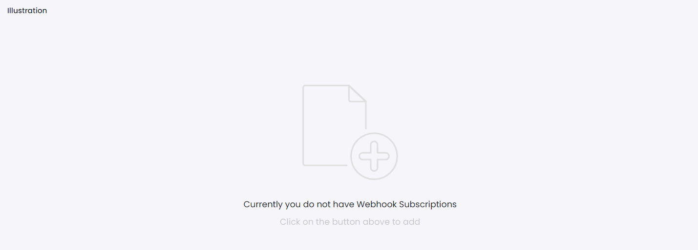

# Illustration

This library was generated with [Angular CLI](https://github.com/angular/angular-cli) version 13.2.0.

## Code
`<rds-illustration label="Currently you do not have Webhook Subscriptions" subLabel="Click on the button above to add"></rds-illustration>`

## Options
### Input
<!-- prettier-ignore -->
| Input Name                  | Type                             |Example| Description                                                                  |
| --------------------------- | -------------------------------- |------------| ---------------------------------------------------------------------------- |
| `label`                | `string`      |"Currently you do not have Webhook Subscriptions"|Specify empty state text      |
| `subLabel`                | `string`      |"Click on the button above to add"|Specify empty state sub text      |

