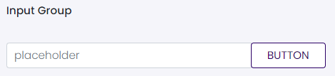

# Input Group

This library was generated with [Angular CLI](https://github.com/angular/angular-cli) version 13.2.0.

## Code
`<rds-input-group>`
`<input type="text" class="form-control" id="Errormessage" placeholder="placeholder" />`
`<button class="btn btn-outline-secondary" type="button" id="button-addon1"> Button </button>`
`</rds-input-group>`

## Options
### Input
<!-- prettier-ignore -->
| Input Name                  | Type                             |Example| Description                                                                  |
| --------------------------- | -------------------------------- |------------| ---------------------------------------------------------------------------- |
| `inputGroupSize`                | `sm`\|`md`\|`lg`     |"sm"|Specify size of input group     |
| `label`                | `string`      |""|Specify label     |

