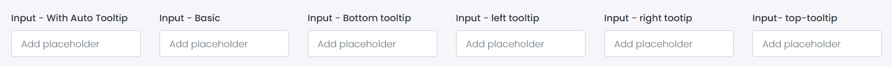

# Input

This library was generated with [Angular CLI](https://github.com/angular/angular-cli) version 13.2.0.

## Options
### Input
<!-- prettier-ignore -->
| Input Name                  | Type                             | Description                                                                  |
| --------------------------- | -------------------------------- | ---------------------------------------------------------------------------- |
| `size`                    | `default`\| `small` \| `large`     | Specify the size of the button               |
| `disabled`                | `boolean`                           |Spcify the input is diabled or not      |
| `readonly`                | `boolean`                           |Spcify the input is readonly or not      |
| `value`                     | `string`                            |Sets value  |
| `placeholder`                    | `string`                           |Sets placeholder  |
| `inputType`                   | `string`                           |Specify the input type                           |
| `TitleType`                    | `Top`\| `Bottom` \| `Floating`     | Specify the position of the title               |
| `inputName`            | `string` | Specify the input field name                               |
| `icon`                    | `string`                           |Put the icon names  |
| `iconWidth`               | `pixel`                            |Specify the width of the icon|
| `iconHeight`              | `pixel`                            |Specify the height of the icon  |
| `isRequired`           | `boolean`                          | Required type or not  |
| `tooltipPlacement`        | `top` \| `bottom` \| `right`\|`left` | Specify the position of the tooltip |
| `tooltipTitle`            | `string`                           | write the tooltip string |

