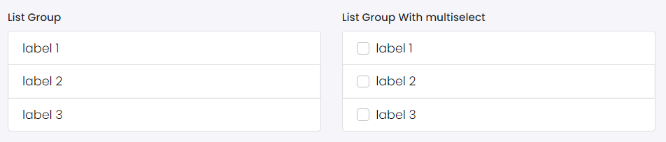

# List Group

This library was generated with [Angular CLI](https://github.com/angular/angular-cli) version 13.2.0.

## Code
`<rds-list-group [flush]="false" listType="list" [multiSelect]="false" [orderList]="false" [listItem]="listItem" (onClick)="onClick($event)" [list]="list">`
`<ng-template #list let-item> <li [ngClass]="item.type"> {{item.label}} </li></ng-template></rds-list-group>`

## Options
### Input
<!-- prettier-ignore -->
| Input Name                  | Type                             |Example| Description                                                                  |
| --------------------------- | -------------------------------- |------------| ---------------------------------------------------------------------------- |
| `multiSelect`        | `boolean`                            |"false"|Specify multi select required or not  |
| `listItem`           | `any[]`     | `[{'label': 'label 1','disabled': true,'badgeLabel': '10','listHeading': '', 'listContent':'', 'listTime':''.'type':''},{'label': 'label 2','disabled': true,'badgeLabel': '2','listHeading': '', 'listContent':'', 'listTime':''.'type':''},{'label': 'label 3','disabled': true,'badgeLabel':'5','listHeading': '', 'listContent':'', 'listTime':''.'type':''}]`|Specify the list items |

### Output
| Output Name                 | Type          | Description                     |      
| --------------------------- | --------------|------------------|
| `onClick`                 |  `EventEmitter`  | `Emits the selected item event on click of item`
