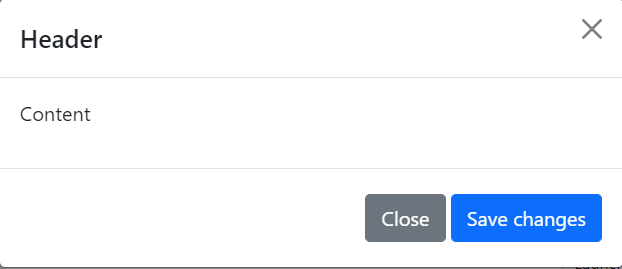

# Modal

This library was generated with [Angular CLI](https://github.com/angular/angular-cli) version 13.2.0.

## code
`<rds-modal modalId="storybookModal" (onShow)="onShow($event)">`  
  `
`  
   `<button`  
      `style="float:right"`  
      `type="button"`   
      `class="btn-close"`  
      `data-bs-dismiss="modal"`  
      `aria-label="Close"`  
      `(click)="onClose($event)"`  
    `></button>`  
    `<h5 class="modal-title" id="storybookModal">{{modalData.modalHeader}}</h5>`  
  `
`  
  `
`  
    `
{{modalData.modalContent}}
`  
  `
`  
  `
`  
    `<button`  
     ` type="button"`  
      `(click)="onClose($event)"`  
      `class="btn btn-secondary m-1"`  
      `data-bs-dismiss="modal"`  
    `>`  
      `Close`  
    `</button>`  
    `<button type="button" (click)="showAlert()" class="btn btn-primary">`  
     ` Save changes`  
    `</button>`  
  `
`  
`</rds-modal>`   

## Options
### Input
<!-- prettier-ignore -->
| Input Name                  | Type                             |Example| Description                                                                  |
| --------------------------- | -------------------------------- |------------| ---------------------------------------------------------------------------- |
| `modalData`                | `object`                          |`modalData : {modalHeader : "Header"modalContent : "I will not close if you click outside me. Don't even try to press escape key."modalFooter : "Footer"}`|Add contents of the modal
| `modalId`                    | `string`                          | "ModalID"|Set modal Id |
| `backdropstatic`              |  `string`                         | "static"|For set radio button group as style of input group|
| `switch`                    | `boolean` |     "false"|For chnaging the style of radio button to switch           |

### Output
| Output Name                 | Type          | Description                     |      
| --------------------------- | --------------|------------------|
| `onClick`                 |  `EventEmitter`  | `Emit any value from modal while click on the modal`  |
| `onClose`                 |  `EventEmitter`  | `Emit any value from modal while closing the modal`  |
| `onShow`                 |  `EventEmitter`  | `Emit any value from modal open the modal`  |
