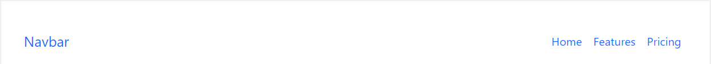

# NavBar

This library was generated with [Angular CLI](https://github.com/angular/angular-cli) version 13.2.0.

## Options
### Input
<!-- prettier-ignore -->
| Input Name                  | Type                             |Example| Description                                                                  |
| --------------------------- | -------------------------------- |------------| ---------------------------------------------------------------------------- |
| `type`                      | `smallt`\|`medium`\|`large`\|`extra large`                          |"small"|Specify the type of the Navbar
| `navbarItems`               | `array list`                          | `[{"label": "Home","isActive": true,"navclass": "","href": ""},{"label": "Features","isActive":` `false,"navclass": "","href": ""},{"label": "Pricing","isActive": false,"navclass": "","href": ""}]`|Specify the navbar content and it's features |
