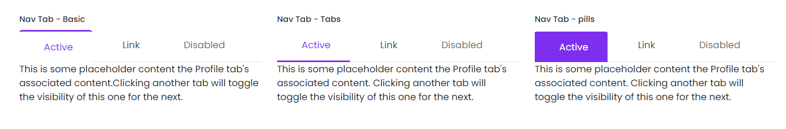

# NavTab

This library was generated with [Angular CLI](https://github.com/angular/angular-cli) version 13.2.0.

  
 

## Code
`
`  
 ` <rds-nav-tab`   
  `  [navtabsItems]="navtabsItems"`  
  `  horizontalAlignment="start"`  
  `  [verticalAlignment]="false"`  
   ` [pills]="false"`  
  `  [tabs]="false"`  
  `  [fill]="false"`  
  `  [justified]="false"`  
  `  [flex]="false"`  
  `></rds-nav-tab>`  
  `
`  
  `  <div`  
   `   class="tab-pane fade show active p-2"`  
   `   id="nav-home"`  
   `   role="tabpanel"`  
    `  aria-labelledby="nav-home-tab"`  
   ` >`  
    `  
`  
    `    
`  
     `     This is some placeholder content the Profile tab's associated content.`  
      `    Clicking another tab will toggle the visibility of this one for the`  
      `    next.`  
      `     `  
      `    The tab JavaScript swaps classes to control the content visibility and`  
       `   styling. You can use it with tabs, pills, and any other`  
       ` 
`  
      `
`  
   ` 
`  
    `<div`  
     ` class="tab-pane fade"`  
     ` id="nav-profile"`  
     ` role="tabpanel"`  
     ` aria-labelledby="nav-profile-tab"`  
   ` >`  
    `  
`  
     `   This is some placeholder content the Home tab's associated content.`  
     `   Clicking another tab will toggle the visibility of this one for the`  
      `  next.`  
      `   `  
      `  The tab JavaScript swaps classes to control the content visibility and`  
      `  styling. You can use it with tabs, pills, and any other .nav-powered`  
      `  navigation.`  
     ` 
`  
   ` 
`  
   ` <div`  
   `   class="tab-pane fade"`  
   `   id="nav-contact"`  
     ` role="tabpanel"`  
     ` aria-labelledby="nav-contact-tab"`  
   ` >`  
    `  
Tab3
`  
   ` 
`  
   ` <div`  
     ` class="tab-pane fade"`  
     ` id="nav-deabled"`  
    `  role="tabpanel"`  
    `  aria-labelledby="nav-contact-tab"`  
    `>`  
    `  
test
`  
   ` 
`  
 ` 
`  
`
`  
## Options
### Input
<!-- prettier-ignore -->
| Input Name                  | Type                             |Example| Description                                                                  |
| --------------------------- | -------------------------------- |------------| ---------------------------------------------------------------------------- |
| `navtabsItems`              | `array of object`              |`[{label: 'Active',tablink: '#nav-home',ariacontrols: 'nav-home',iconClass: 'bi bi-house',subText: 'Active subtext'},{label: 'Link',tablink: '#nav-profile',ariacontrols: 'nav-profile'},{label: 'Active',tablink: '#nav-home',ariacontrols: 'nav-home',iconClass: 'bi bi-house',subText: 'Active subtext'},{label: 'Active',tablink: '#nav-home',ariacontrols: 'nav-home',iconClass: 'bi bi-house',subText: 'Active subtext'}]`|Add navtab items
| `verticalAlignment`         | `boolean`                          | "true"|For align the tab vertically |

### Output
| Output Name                 | Type          | Description                     |      
| --------------------------- | --------------|------------------|
| `onClicktab`                 |  `EventEmitter`  | `Emit the tab number of the navtab while clicking the tabs`  |
