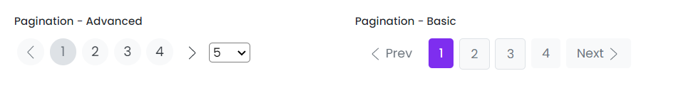

# Pagination

This library was generated with [Angular CLI](https://github.com/angular/angular-cli) version 13.2.0.

## Code

`<rds-pagination`  
 ` [totalRecords]="101"`  
`  [recordsPerPage]="5"`  
`  size="medium"`  
`  alignmentType="start"`  
`  role="Advanced"`  
`  [reset]="false"`  
`  (onPageChange)="onPageChange($event)"`  
`  (onRecordsPerPageChange)="onRecordsPerPageChange($event)"`  
`></rds-pagination>`  

## Options
### Input
<!-- prettier-ignore -->
| Input Name                  | Type                             |Example| Description                                                                  |
| --------------------------- | -------------------------------- |------------| ---------------------------------------------------------------------------- |
| `totalRecords`                | `number`                          |"20"|Specify the number of records
| `recordsPerPage`                    | `number`                          | "10"|Specify the records per page |
| `role`              |  `basic`\|`advanced`                         | "basic"|For set the type of pagination|
| `alignmentType`                    |`start`\|`center`\|`end`     |"start"|Specify the position of the pagination           |
| `size`                    |`large`\|`small`\|`medium` |     "large"|Specify the size of the pagination           |

### Output
| Output Name                 | Type          | Description                     |      
| --------------------------- | --------------|------------------|
| `onPageChange`                 |  `EventEmitter`  | `Emit pagination object on change of the pagination`  |
| `onRecordsPerPageChange`                 |  `EventEmitter`  | `Emit pagination object on change of the records per page`  |

