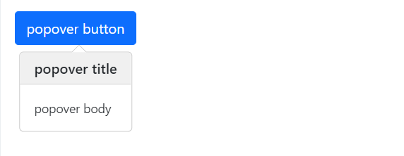

# Popover

This library was generated with [Angular CLI](https://github.com/angular/angular-cli) version 13.2.0.

## Code
`<rds-popover`  
 ` [popoverPosition]="popoverPosition"`  
 ` [popoverTitle]="popoverTitle"`    
  `(click)="onClick($event)"`  
 ` [popoverContent]="popoverContent"`  
`>`  
  `<button class="btn btn-primary">popover button</button>`   
`</rds-popover>`   
## Options
### Input
<!-- prettier-ignore -->
| Input Name                  | Type                             |Example| Description                                                                  |
| --------------------------- | -------------------------------- |------------| ---------------------------------------------------------------------------- |
| `popoverPosition`           | `top`\|`bottom`\|`right`\|`left` |"top"|Specify the psition of the popover
| `popoverTitle`              | `string`                         | "Title"|For add the title of the popover |
| `popoverContent`            |  `string`                       | "Content"|For add thge content of the popover|
| `hover`                     | `boolean` |     "false"|For Enable or desable the hover property of the popover          |

### Output
| Output Name                 | Type          | Description                     |      
| --------------------------- | --------------|------------------|
| `onClick`                 |  `EventEmitter`  | `Emit any value from the popover`  |

