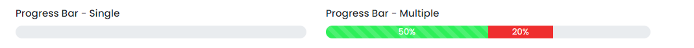

# Progressbar

This library was generated with [Angular CLI](https://github.com/angular/angular-cli) version 13.2.0.

## Code 

`<rds-progressbar`
 ` [animation]="false"`
`  height="15"`
`  colorVariant="default"`
`  striped="default"`
`  progressWidth="400"`
`  progressbar_MaxWidth="800"`
`  [label]="false"`
`  role="single"`
`  [progressvalues]="progressvalues"`
`></rds-progressbar>`
## Options
### Input
<!-- prettier-ignore -->
| Input Name                  | Type                             |Example| Description                                                                  |
| --------------------------- | -------------------------------- |------------| ---------------------------------------------------------------------------- |
| `progressvalues`                | `array list`                          |`[{progressWidth: '50%', background: 'bg-success',stripe: 'progress-bar-striped',animation: 'progress-bar-animated'}]`|Add items Progressbar
| `striped`                    | `default`\|`progress-bar-striped`                          | "default"|For enable the striped property for progressbar |
| `progressWidth`              |  `number`                         | "400"|For set width of the progressbar|
| `animation`                    | `boolean` |     "false"|For enable the animation           |
| `role`                    | `single`\|`multiple`   |     "multiple"|For specify the type of the progress bar         |

