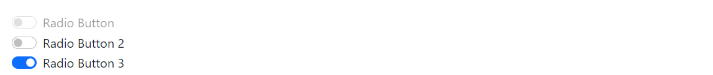

# RadioButton

This library was generated with [Angular CLI](https://github.com/angular/angular-cli) version 13.2.0.

  

## Code

`<rds-radio-button`  
`  [switch]="false"`  
 ` [inline]="false"`  
`  [isInputGroup]="false"`  
`  [itemList]="itemList"`  
`  (onClick)="onClick($event)"`  
`></rds-radio-button>`  

## Options
### Input
<!-- prettier-ignore -->
| Input Name                  | Type                             |Example| Description                                                                  |
| --------------------------- | -------------------------------- |------------| ---------------------------------------------------------------------------- |
| `listItems`                | `array list`                          |`[{id: 1,label: 'Radio Button', checked: 'false',disabled: 'true',name: 'Radio-Button'}]`|Add items for the radio button
| `inline`                    | `boolean`                          | "true"|Specify the radio button group is inline or not |
| `isInputGroup`              |  `boolean`                         | "false"|For set radio button group as style of input group|
| `switch`                    | `boolean` |     "false"|For chnaging the style of radio button to switch           |

### Output
| Output Name                 | Type          | Description                     |      
| --------------------------- | --------------|------------------|
| `onChange`                 |  `EventEmitter`  | `Emit value of the radio button on change of the radio button`  |
| `onTouched`                 |  `EventEmitter`  | `Emit value of the radio button on touch of the radio button`  |
| `onClick`                 |  `EventEmitter`  | `Emit value of the radio button on click of the radio button`  |

