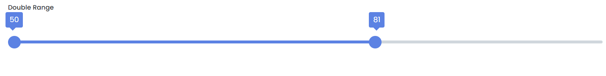

# Range

This library was generated with [Angular CLI](https://github.com/angular/angular-cli) version 13.2.0.

## Code 
 `<rds-double-range [min]="50" [max]="100"></rds-double-range>`  
 
## Options
### Input
<!-- prettier-ignore -->
| Input Name                  | Type                             |Example| Description                                                                  |
| --------------------------- | -------------------------------- |------------| ---------------------------------------------------------------------------- |
| `min`                        | `string`                        |"1000"|Specify the minimum range  |                             |
| `max`                        | `string`                        | "2000"|Specify the maximum range |
| `disabled`                   |  `boolean`                      | "false"|For enable and desable the range|
| `customstyle`                | `style1`\|`style2`\|`style3`    |"style1"|specific style for the range    |

### Output
| Output Name                 | Type          | Description                     |      
| --------------------------- | --------------|------------------|
| `onChange`                 |  `EventEmitter`  | `Emit min and max value at on change of the range`  |
| `onTouched`                 |  `EventEmitter`  | `Emit min and max value at on touch of the range`  |
