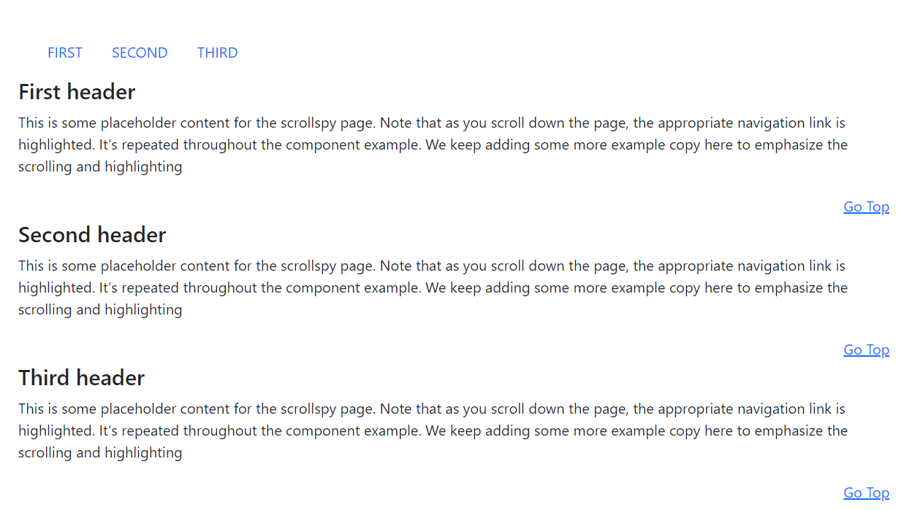

# Scrollspy

This library was generated with [Angular CLI](https://github.com/angular/angular-cli) version 13.2.0.

  

## code
`
`   
    `<nav class="navbar navbar-light px-3">`   
    `    <ul class="nav nav-pills">`    
     `       <li class="nav-item">`  
      `          <a class="nav-link text-uppercase"`  
       `            target="_self"`  
       `            href="#scrollspyHeading1">`  
       `             First`  
       `         </a>`  
      `      </li>`  
       `     <li class="nav-item">`  
         `       <a class="nav-link text-uppercase"`  
       `            target="_self"`  
          `         href="#scrollspyHeading2">`  
            `        Second`  
            `    </a>`  
          `  </li>`  
          `  <li class="nav-item">`  
          `      <a class="nav-link text-uppercase"`  
          `         target="_self"`  
         `          href="#scrollspyHeading3">`  
          `          Third`  
         `       </a>`  
         `   </li>`  
      `  </ul>`  
   ` </nav>`  
`
`  
`<rds-scrollspy scrollId="scrollspy">`  
  `  <scrollspy-item scrollItemId="scrollspyHeading1" header="First header">`  
    `    
`  
      `      This is some placeholder content for the scrollspy page. Note that as you`  
       `     scroll down the page, the appropriate navigation link is highlighted. It's`  
        `    repeated throughout the component example. We keep adding some more`  
         `   example copy here to emphasize the scrolling and highlighting`  
       ` 
`  
      `  
`  
       `     <a href="#scrollspy" target="_self" class="m-1">Go Top</a>`  
      `  
`  
   ` </scrollspy-item>`  
  `  <scrollspy-item scrollItemId="scrollspyHeading2" header="Second header">`  
  `      
`  
   `         scroll down the page, the appropriate navigation link is highlighted. It's`  
    `         repeated throughout the component example. We keep adding some more`  
    `          example copy here to emphasize the scrolling and highlighting`  
     `     
`  
    `    
`  
    `        <a href="#scrollspy" target="_self" class="m-1">Go Top</a>`  
    `    
`  
  `  </scrollspy-item>`  
  `  <scrollspy-item scrollItemId="scrollspyHeading3" header="Third header">`  
   `     
`  
   `         This is some placeholder content for the scrollspy page. Note that as you`  
   `         scroll down the page, the appropriate navigation link is highlighted. It's`  
   `         repeated throughout the component example. We keep adding some more`  
   `         example copy here to emphasize the scrolling and highlighting`  
   `     
`  
    `    
`  
    `        <a href="#scrollspy" target="_self" class="m-1">Go Top</a>`  
     `   
`  
   ` </scrollspy-item>`  
`</rds-scrollspy>`      

## Options
### Input
<!-- prettier-ignore -->
| Input Name                  | Type                             |Example| Description                                                                  |
| --------------------------- | -------------------------------- |------------| ---------------------------------------------------------------------------- |
| `scrollId`                    | `string`                          | "scrollspyID"|Specify the ID of the scrollspy |

