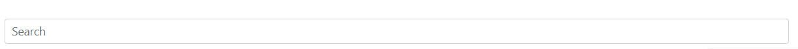

# SearchInput

This library was generated with [Angular CLI](https://github.com/angular/angular-cli) version 13.2.0.

## Code 
`<rds-select-list`  
 ` size="default"`  
  `[disabled]="false"`  
 ` [multiple]="false"`  
 ` customIcon=""`  
 ` [tooltipTitle]="tooltipTitle"`  
`  [tooltipPlacement]="tooltipPlacement"`  
`>`  
  `<option selected>Open this select menu</option>`  
  `<option value="1">One</option>`  
  `<option value="2">Two</option>`  
  `<option value="3">Three</option>`  
`</rds-select-list>`  

## Options
### Input
<!-- prettier-ignore -->
| Input Name                  | Type                             |Example| Description                                                                  |
| --------------------------- | -------------------------------- |------------| ---------------------------------------------------------------------------- |
| `Placeholder`                     | `string`                            |"Search"|For add the placeholder to the serch element  |                             |
| `icon`           | `string`                          | "bi bi-search"|Add the icon in the search element |
| `size`                   |  `default`\|`small`\|`large`                         | "default"|For set the size of the search element|
| `value`                   |  `string`                         | "value"|value of the serch element|

### Output
| Output Name                 | Type          | Description                     |      
| --------------------------- | --------------|------------------|
| `onClick`                 |  `EventEmitter`  | `Emit value of the serch element, on click of the search element`  |

