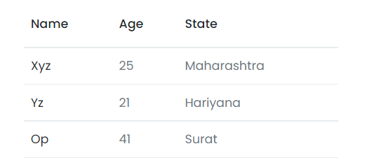

# Table

This library was generated with [Angular CLI](https://github.com/angular/angular-cli) version 13.2.0.

## Code

`<rds-table [thead]="thead" [tbody]="tbody">`  
  `<ng-template #thead>`  
   ` <th>Name</th>`  
 `   <th>Age</th>`  
 `   <th>State</th>`  
`  </ng-template>`  
`  <ng-template #tbody let-val>`  
`    <tr>`  
 `     <td>{{val.name}}</td>`  
  `    <td>{{val.age}}</td>`  
  `    <td>{{val.state}}</td>`  
  `  </tr>`  
 ` </ng-template>`  
`</rds-table>`  
## Options
### Input
<!-- prettier-ignore -->
| Input Name                  | Type                             |Example| Description                                                                  |
| --------------------------- | -------------------------------- |------------| ---------------------------------------------------------------------------- |
| `border`                    | `boolean`                            |"false"|For add border for the table  |                             |
| `hover`           | `boolean`                          | "true"|For enable and diable hover property for the table |
| `stripe`                      |  `boolean`                       | "false"|Enable and disable strip property of the table|
| `tableItems`               | `string`|     ""[{ name: \"xyz\", age: 25, state: \"Maharashtra\" }, { name: \"yz\", age: 21, state: \"Hariyana\" }, { name: \"op\", age: 41, state: \"Surat\" }]""|Content of the table         |

