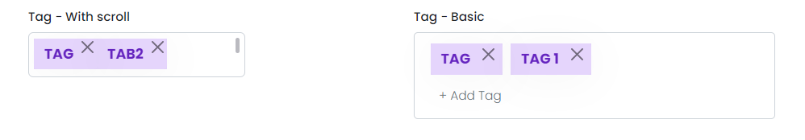

# Tags

This library was generated with [Angular CLI](https://github.com/angular/angular-cli) version 13.2.0.

## Code
`<rds-tags`  
 ` tagType="Square"`  
 ` closeButtonStyle="Normal"`  
 ` roles="TagWithScroll"`  
 ` colorVariant="primary"`  
`></rds-tags>`  

## Options
### Input
<!-- prettier-ignore -->
| Input Name                  | Type                             |Example| Description                                                                  |
| --------------------------- | -------------------------------- |------------| ---------------------------------------------------------------------------- |
| `tagType`                    | `string`                            |"squere"|Specify the type of the tag  |                             |
| `closeButtonStyle`           | `string`                          | "Normal"|Specify style of the close button |
| `roles`                      |  `basic`\| `TagWithScroll`                         | "basic"|Type of the textbox of the tag|
| `colorVariant`               | `success`\|`primary`\|`secondary`\|`danger`|     "success"|For change the color of the tag element             |
| `Borderstyle`                | `dotted`\|`solid`\|`none`\|                          |"dotted"   |Specify the style of the tag in 

### Output
| Output Name                 | Type          | Description                     |      
| --------------------------- | --------------|------------------|
| `onKeyDownEvent`                 |  `EventEmitter`  | `Emit value of the tag element on key press of the tag`  |
