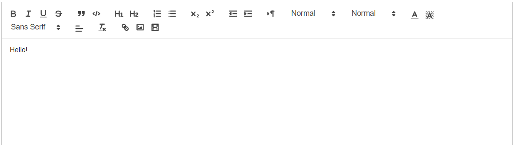

# TextEditor

This library was generated with [Angular CLI](https://github.com/angular/angular-cli) version 13.2.0.

## Code 
`<rds-text-editor id="" editorData="
Hello!
"></rds-text-editor>`  
## Options
### Input
<!-- prettier-ignore -->
| Input Name                  | Type                             |Example| Description                                                                  |
| --------------------------- | -------------------------------- |------------| ---------------------------------------------------------------------------- |
| `id`                     | `string`                            |"Texteditor id"|For specify the Id of the Texteditor |                             |
| `editorData`           | `string`                          | "Hello!"|Content of the text editor|

