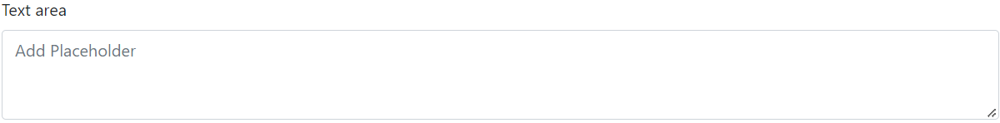

# Textarea

This library was generated with [Angular CLI](https://github.com/angular/angular-cli) version 13.2.0.
<p align="left">

<p/>

## Code 
```bash
 <rds-textarea  
 value=""  
 [disabled]="false"  
 rows="3" 
 [readonly]="false" 
 label="Text area"
 floatinginputLabel=""  
 placeholderText="Add Placeholder" 
 tooltipTitle="This is tooltip"
 tooltipPlacement="bottom"></rds-textarea>
```

## Options
### Input
<!-- prettier-ignore -->
| Input Name                  | Type                             |Example| Description                                                                  |
| --------------------------- | -------------------------------- |------------| ---------------------------------------------------------------------------- |
| `disabled`                     | `boolean`                            |"false"|For disable and enable the textarea  |                             |
| `rows`           | `number`                          | 20|Specify Number of rows of the text area |
| `readonly`                   |  `boolean`                         | "false"|For set the text area as read only|
| `label`                    | `string` |     "Texarea"|For Add the label for the Text area             |
| `placeholderText`                | `string`                          |"Placeholder"   |Add the placeholder for the text area
| `floatinginputLabel`                | `string`                           |"Floating label"|For adding the floating input label for the textarea    |
| `tooltipPlacement`               | `top`\|`bottom`\|`right`\|`left`                      |"top"|Specify position of the tooltip    |
| `tooltipTitle`                | `string`                           |"this is tooltip"|For Adding the title for the tooltip       |
| `value`                |`string`                             |"textarea value"|Get the value of the text area   |


### Output
| Output Name                 | Type          | Description                     |      
| --------------------------- | --------------|------------------|
| `onChanged`                 |  `EventEmitter`  | `Emit value of the textarea on change of the text area`  |
| `onTouched`                 |  `EventEmitter`  | `Emit value of the textarea on touch of the text area`  |

