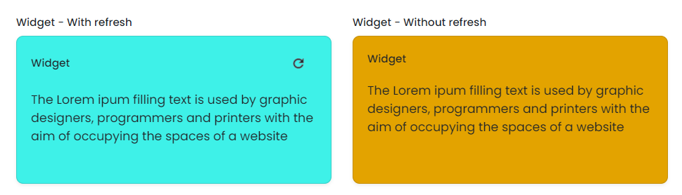

# Widget

This library was generated with [Angular CLI](https://github.com/angular/angular-cli) version 13.2.0.

## Code
`<rds-widget`  
 ` headerTitle="Widget"`  
  `[isRefreshRequired]="true"`  
  `colorVariant="light"`  
  `cardheight="card-stretch"`  
  `(onRefresh)="onRefresh($event)"`  
`></rds-widget>`  

## Options
### Input
<!-- prettier-ignore -->
| Input Name                  | Type                             |Example| Description                                                                  |
| --------------------------- | -------------------------------- |------------| ---------------------------------------------------------------------------- |
| `colorVariant`              | `light`\|`dark`\|`white`\|`info`\|`warning`\|`danger`\|`success`\|`secondary`\|`primary` | "light"|Specify the color variant of the widget |
| `cardheight`                |`card-stretch`\|`card-stretch-half`                      | "card-stretch"|For set the card height|

### Output
| Output Name                 | Type          | Description                     |      
| --------------------------- | --------------|------------------|
| `onRefresh`                 |  `EventEmitter`  | `Emit value from the widget on refresh`  |
