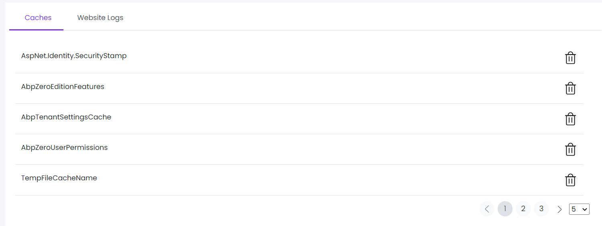

# Cache

This library was generated with [Angular CLI](https://github.com/angular/angular-cli) version 13.2.0.
<p align="left">

<p/>

## ✒️ Code
```bash
<app-rds-comp-cache
  [cashedata]="cashedata"
  role="Advanced"
  alignmentType="end"
  [resetPagination]="false"
  [recordsPerPage]="10"
></app-rds-comp-cache>
```

## Options
### 🏗️ Input
<!-- prettier-ignore -->
| Input Name                  | Type                             |Example| Description                                                                  |
| --------------------------- | -------------------------------- |------------| ---------------------------------------------------------------------------- |
| role                     | string                            |"Advanced"|Specify the type of pagination  |                             |
| alignmentType           | string                          | "end"|Specify alignement of pagination  |
|resetPagination                  |  boolean                         | "false"|Specify reseting pagination required or not |
| recordsPerPage                    | number |     "10"|Specify number of records per page              |
| cashedata                | []                           |<pre>[{"name": "AbpUserSettingsCache"},{"name": "AbpZeroRolePermissions"},<br>{"name": "AbpZeroTenantCache"},{"name": "AbpZeroEditionFeatures"},<br>{"name": "AbpTenantSettingsCache"},{"name": "token_validity_key"},<br>{"name": "AbpZeroMultiTenantLocalizationDictionaryCache"},<br>{"name": "AspNet.Identity.SecurityStamp"},{"name": "TempFileCacheName"},<br>{"name": "AbpApplicationSettingsCache"},{"name": "AbpZeroUserPermissions"},<br>{"name": "AbpZeroLanguages"}]</pre>|Specify the cache data  |

