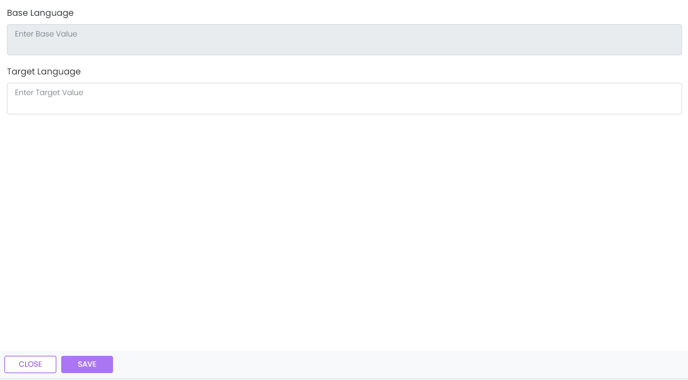

# Edit Language Text

This library was generated with [Angular CLI](https://github.com/angular/angular-cli) version 13.2.0.
<p align="left">

<p/>

## ✒️ Code
```bash
<app-rds-comp-edit-language-text
  [Languagetext]="Languagetext"
></app-rds-comp-edit-language-text>
```

## Options
### 🏗️ Input
<!-- prettier-ignore -->
| Input Name                  | Type                             |Example| Description                                                                  |
| --------------------------- | -------------------------------- |------------| ---------------------------------------------------------------------------- |
| Languagetext               | []                         |<pre>[{baseValue: 'Tenant', sourceName: 'DemoDB', baseLanguageName: 'en-gb', languageName: 'eb', value: 'Tenant', key: 'Tenant'}]<pre>  |Specify the language text data 


### 💻 Output
| Output Name                 | Type          | Description                     |      
| --------------------------- | --------------|------------------|
| onLanguageTextSave                 |  EventEmitter  | Emits the language text data for save
