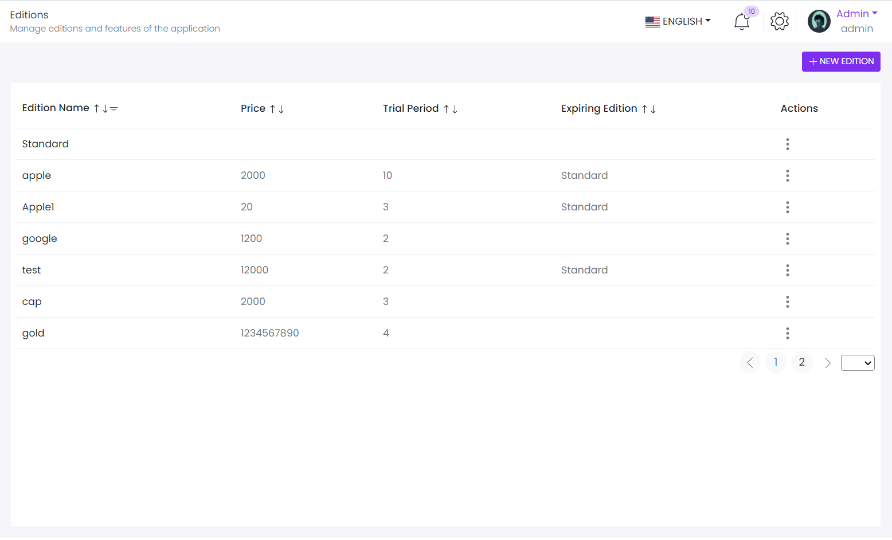
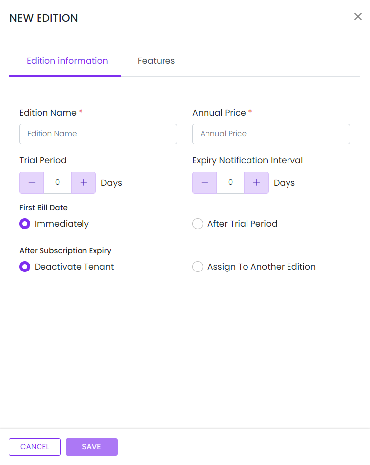
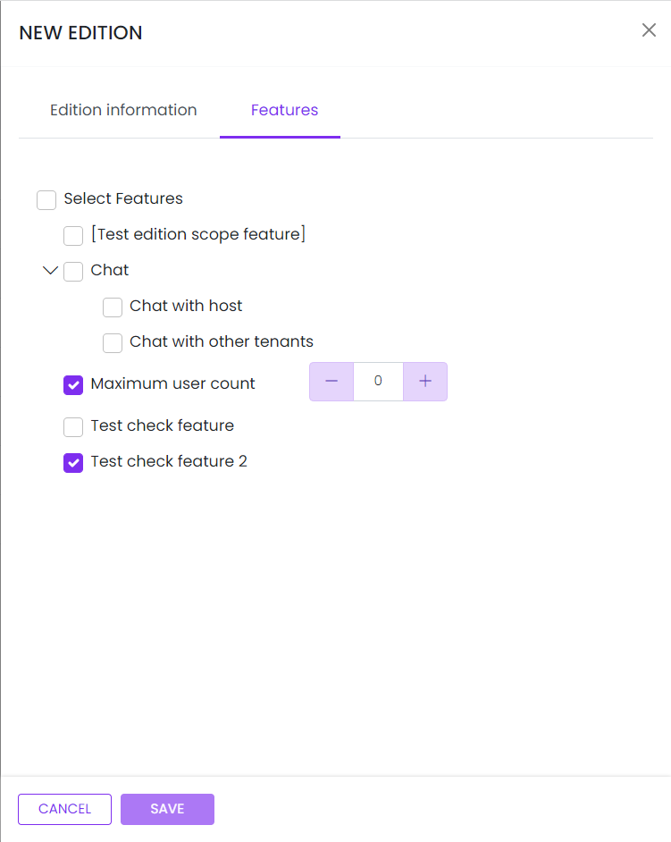

# Edition

This library was generated with [Angular CLI](https://github.com/angular/angular-cli) version 13.2.0.

<p align="left">

  
   
<p/>

## ✒️ Code

 
```bash
public rdsEditionMfeConfig: ComponentLoaderOptions;
this.rdsEditionMfeConfig = {
      name: 'RdsCompFeatures',
      input: {
        EditionsTableHeader: this.TableHeader,
        EditionsTableData: this.EditionDatatable,
        recordsPerpage: 7,
        nodeColors: this.nodeColors,
        treeData: this.treeData,
        featureList: this.featureList,
        noDataTitle: 'Currently you do not have edition',
        editionList: this.editionList,
        freeEditions: this.freeEditions,
        tenantCount:0
      },
      output: {
        onEditionSave: (data) => {
          if (data) {
            if (data.edition.id !== undefined) {
              this.store.dispatch(updateEdition(data))
            } else {
              this.store.dispatch(saveEdition(data))
            }
          }

        },
        updateEdition: (id) => {
          this.store.dispatch(getEditionInfo(id))
        },
        deleteEdition: (data) => {
          this.store.dispatch(deleteEdition(data.id));
        },
        onMoveTenantAction: (editionId) => {
          this.store.dispatch(getTenantCount(editionId));
        },
        onMoveTenant: (data) => {
          this.store.dispatch(moveTenant(data));
        }
      }
    }
    In html file
    <mfe-loader [config]="rdsEditionMfeConfig"></mfe-loader>
```


## Options
### 🏗️ Input
<!-- prettier-ignore -->
| Input Name                  | Type                             |Example| Description                                                                  |
| --------------------------- | -------------------------------- |------------| ---------------------------------------------------------------------------- |
| ChartDataSets             | array list        |<pre>[{"label":"Dataset 1","data":[0.5,0.8,0.4,0.6,0.7,0.2,0.9],"borderColor":["#ff9f40"],"backgroundColor":["rgba(255, 99, 132, 0.2)"],<br>"fill":false,"pointStyle":"circle","pointRadius":2},{"label":"Dataset 2","data":[0.9,0.3,0.8,0.9,0.1,0.7,0.2],<br>"borderColor":["#ff6384"],"backgroundColor":["rgba(255, 206, 86, 0.2)"],<br>"fill":true,"pointStyle":"circle","pointRadius":2},{"label":"Dataset 3","data":[0.7,0.2,0.1,0.9,0.8,0.4,0.7],<br>"borderColor":["#83BE5A"],"backgroundColor":["rgba(255, 240, 204, 0.2)"],"fill":false,"pointStyle":"circle",<br>"pointRadius":2}]<pre>|Data set of the Radar Chart
| chartLabels               | array                          | `["Jan","Feb","Mar","Apr","May","jun","jul"]`|Specify chart labels|
| chartWidth                |  string                       | "200"|Specify the width of the chart|
| chartHeight                |  number                       | "200"|Specify the height of the chart|
| chartId                |  string                       | "chartid"|Specify the ID of the chart|
| chartStyle                |  Dark\|light                       | "Dark"|Specify the style of the chart|
|chartOptions|Object|<pre>{"responsive":false,"chartArea":{"backgroundColor":"rgba(251, 85, 85, 0.4)"},"plugins":{"title":{"display":true,"text":"Radar Chart"},<br>"legend":{"position":"left","align":"start","pointStyle":"rectRot","pointRadius":5,"labels":{"usePointStyle":true}},"tooltip":{"usePointStyle":true},<br>"scale":{"type":"line","angleLines":{"display":true}}},"scales":{"r":{"axis":"r","type":"radialLinear","display":true,"animate":true,"position":"chartArea",<br>"angleLines":{"display":true,"lineWidth":1,"borderDash":[],"borderDashOffset":0,"color":"rgba(0,0,0,0.1)"},<br>"grid":{"circular":false,"display":true,"lineWidth":1,"drawBorder":true,"drawOnChartArea":true,"drawTicks":true,"tickLength":8,<br>"offset":false,"borderDash":[],"borderDashOffset":0,"borderWidth":1,"color":"rgba(0,0,0,0.1)","borderColor":"rgba(0,0,0,0.1)"},<br>"startAngle":0,"ticks":{"showLabelBackdrop":true,"color":"#666","minRotation":0,"maxRotation":50,"mirror":false,"textStrokeWidth":0,<br>"textStrokeColor":"","padding":3,"display":true,"autoSkip":true,"autoSkipPadding":3,"labelOffset":0,"minor":{},"major":{},"align":"center","crossAlign":"near",<br>"backdropColor":"rgba(255, 255, 255, 0.75)","backdropPadding":2},"pointLabels":{"backdropPadding":2,"display":true,"font":{"size":10},"padding":5,<br>"centerPointLabels":false,"color":"#666"},"offset":false,"reverse":false,"beginAtZero":false,"bounds":"ticks","grace":0,<br>"title":{"display":false,"text":"","padding":{"top":4,"bottom":4},"color":"#666"},"id":"r"}}}<pre>|Chart options|
