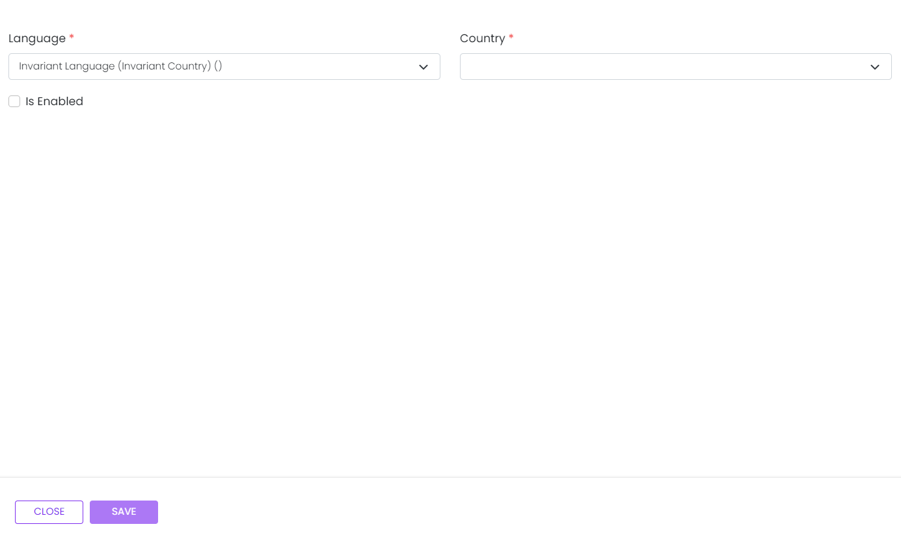

# New Language

This library was generated with [Angular CLI](https://github.com/angular/angular-cli) version 13.2.0.
<p align="left">

<p/>

## ✒️ Code
```bash
<app-rds-comp-new-language
  [flags]="flags"
  [languageNames]="languageNames"
></app-rds-comp-new-language>
```

## Options
### 🏗️ Input
<!-- prettier-ignore -->
| Input Name                  | Type                             |Example| Description                                                                  |
| --------------------------- | -------------------------------- |------------| ---------------------------------------------------------------------------- |
| languageNames    | `[]` | <pre>{"value": "famfamfam-flags ad", "displayText": "ad", "isSelected": false},<br> {"value": "famfamfam-flags ae",   "displayText": "ae", "isSelected": false },<br> { "value": "famfamfam-flags af", "displayText": "af", "isSelected": false }<pre>|Specify language names   |
| flags               | `[]`                           |<pre>[{ "value": "", "displayText": "Invariant Language (Invariant Country) ()", "isSelected": false },<br> { "value": "aa", "displayText": "Afar (aa)", "isSelected": false },<br> { "value": "aa-DJ", "displayText": "Afar (Djibouti) (aa-DJ)", "isSelected": false },<br> { "value": "aa-ER", "displayText": "Afar (Eritrea) (aa-ER)", "isSelected": false },<br> { "value": "aa-ET", "displayText": "Afar (Ethiopia) (aa-ET)", "isSelected": false}]</pre>|Specify the flags of countries for country select list |
| selectedLanguage | `[]` |     <pre>{ countryCode: '', icon: '', isEnabled: false, id: undefined, }</pre>  |Specify the selected language data   |


### 💻 Output
| Output Name                 | Type          | Description                     |      
| --------------------------- | --------------|------------------|
| onLanguageSave                 |  `EventEmitter`  | `Emits the selectedLanguage data for save`
