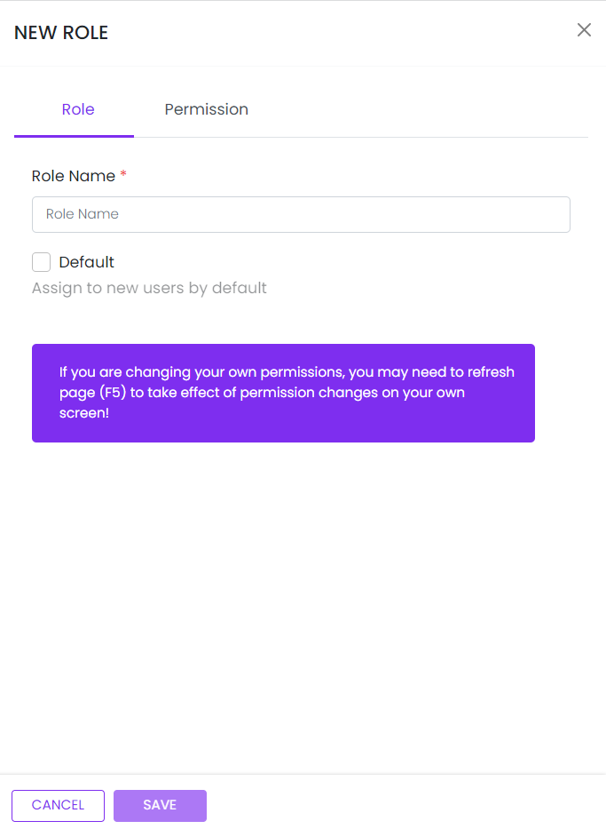

# New Role

This library was generated with [Angular CLI](https://github.com/angular/angular-cli) version 13.2.0.

<p align="left">

<p/>

## ✒️ Code


```bash
 <app-rds-comp-new-role (RoleInfo)="getRoleData($event)" (RoleDataemit)="onchangeRoldate($event)"
          [roleData]="RolesData" (onCancel)="close()">
 </app-rds-comp-new-role>
```

## Options
### 🏗️ Input
<!-- prettier-ignore -->
| Input Name                  | Type                             |Example| Description                                                                  |
| --------------------------- | -------------------------------- |------------| ---------------------------------------------------------------------------- |
| roleData    | `array list`    |<pre>{"displayName":"test","id":"undefined","isDefault":"true"}</pre>| "Object for save and edit the role"
| isReset     | `boolean`       | `false`| For reset the role form |

### 💻 Output
| Output Name                 | Type          | Description                     |      
| --------------------------- | --------------|------------------|
| RoleInfo        |  `EventEmitter`  | `Emit value For saving the role Info`  |
