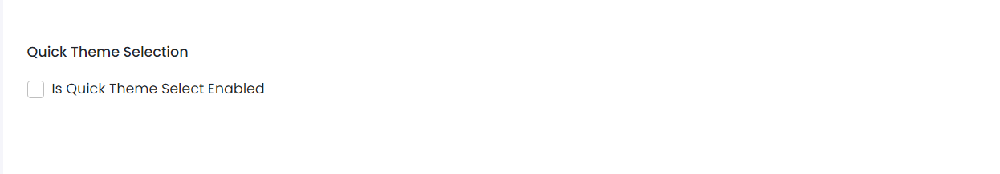

# Other Settings

This library was generated with [Angular CLI](https://github.com/angular/angular-cli) version 13.2.0.
<p align="left">

<p/>

## ✒️ Code
```bash
<app-rds-comp-other-settings
  [OtherSetting]="OtherSetting"
></app-rds-comp-other-settings>
```

## Options
### 🏗️ Input
<!-- prettier-ignore -->
| Input Name                  | Type        |Example     | Description                                                                  |
| --------------------------- | ----------- |------------| ---------------------------------------------------------------------------- |
| OtherSetting              | `any`       |  <pre>{"isQuickThemeSelectEnabled": false} </pre>  |    Specify the other setting data  |

### 💻 Output
| Output Name                  | Type       | Description                                                                  |
| --------------------------- | ----------- |---------------------------------------------------------------------- |
| OtherSettingData              | `EventEmitter`       |    Emits the other settings data for save  |

