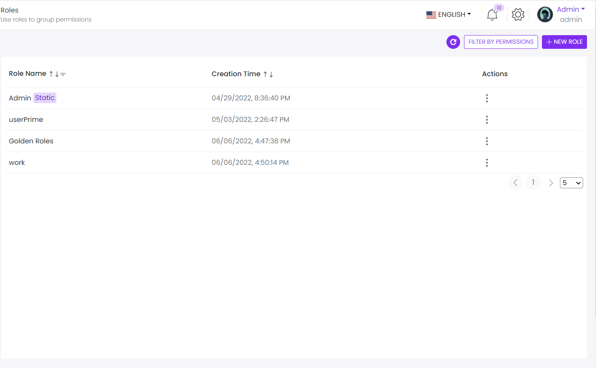

# Role List

This library was generated with [Angular CLI](https://github.com/angular/angular-cli) version 13.2.0.

<p align="left">

<p/>

## ✒️ Code


```bash
 rdsNewRoleMfeConfig: ComponentLoaderOptions = {
    name: 'RdsCompRoleList'
  };
   this.rdsNewRoleMfeConfig = {
      name: 'RdsCompRoleList',
      input: {
        roleHeaders: this.RoleTableHeader,
        roleList: this.RoleDatatable,

      },
      output: {
        onSaveRole: (eventData: any) => {
          if (eventData && eventData.role) {
            if (eventData.grantedPermissionNames && eventData.grantedPermissionNames.length) {
              this.FilterselectedPermissions(eventData.grantedPermissionNames)
              const data: any = {
                role: eventData.role,
                grantedPermissionNames: this.selectedPermissions
              };
              this.store.dispatch(saveRole(data));
            } else {
              const data: any = {
                role: eventData.role,
                grantedPermissionNames: [],
              };
              this.store.dispatch(saveRole(data));
               }
          }
        },
        onEditRole: (event: any) => {
          this.store.dispatch(getRolByEdit(event));
          this.store.select(selectRoleForEdit).subscribe((res: any) => {
            if (res && res.RoleEditI && res.RoleEditI.role) {
              this.Roledetails = {}
              const itemRole: any = {
                displayName: res.RoleEditI.role.displayName,
                id: res.RoleEditI.role.id,
                isDefault: res.RoleEditI.role.isDefault,
              }
              this.Roledetails['displayName'] = res.RoleEditI.role.displayName;
              this.Roledetails['id'] = res.RoleEditI.role.id;
              this.Roledetails['isDefault'] = res.RoleEditI.role.isDefault,
                this.Roledetails = itemRole
              const mfeConfig = this.rdsNewRoleMfeConfig
              mfeConfig.input.RolesData = this.Roledetails
              this.rdsNewRoleMfeConfig = { ...mfeConfig };
            }
            if (res && res.RoleEditI && res.RoleEditI.permissions) {
              this.EditPermissionData = res.RoleEditI.permissions
              this.treeData = this.ConvertArraytoTreedata(res.RoleEditI.permissions)
              if (this.treeData && res.RoleEditI.grantedPermissionNames) {
                this.selectedPermissions = [];
                this.checkSelectedNodes(res.RoleEditI.grantedPermissionNames);

              }
              const mfeConfig = this.rdsNewRoleMfeConfig
              mfeConfig.input.permissionsList = this.treeData
              mfeConfig.input.SelectedPermissionValues = [...this.selectedPermissions]
              mfeConfig.input.SelectedPermissionList = [...res.RoleEditI.grantedPermissionNames]
              this.rdsNewRoleMfeConfig = { ...mfeConfig };
            }
          })
        },
        onnewRole: (data: any) => {
          this.store.dispatch(getPermission());
          this.selectedPermissions=[]
          this.store.select(selectAllPermissions).subscribe((res: any) => {
            if (res && res.PermissionI && res.PermissionI.items)

              this.treeData = this.ConvertArraytoTreedata(res.PermissionI.items)

            const mfeConfig = this.rdsNewRoleMfeConfig
            mfeConfig.input.permissionsList = [... this.treeData];
            mfeConfig.input.SelectedPermissionValues = [...this.selectedPermissions]
            this.rdsNewRoleMfeConfig = { ...mfeConfig };
          })
        },
        onRefreshRole:()=>
        {
          this.store.dispatch(getRoles([]));
          this.updateRoleData();
        },
        onReset: (event: any) => {
          this.Roledetails = undefined;
          this.treeData = [];
          this.selectedPermissions = [];
          const mfeConfig = this.rdsNewRoleMfeConfig
          mfeConfig.input.RolesData = { ... this.Roledetails };
          mfeConfig.input.permissionsList = [... this.treeData];
          mfeConfig.input.tenantFeatures = [... this.selectedPermissions];
          this.rdsNewRoleMfeConfig = mfeConfig;
        },
        deleteEvent: (event: any) => {
          this.store.dispatch(deleteRole(event.id))
        },
        onFilterPermission: (event: any) => {
          if (event && event.length) {
            this.FilterselectedPermissions(event)
            const data: any = {
              grantedPermissionNames: this.selectedPermissions
            };
            this.store.dispatch(getRoles(this.selectedPermissions));
            this.updateRoleData();
          }
        },
        onFilterPermissionReset: (event: any) => {
          this.treeData = [];
          this.selectedPermissions = [];
          const mfeConfig = this.rdsNewRoleMfeConfig
          mfeConfig.input.RolesData = { ... this.Roledetails };
          mfeConfig.input.permissionsList = [... this.treeData];
          mfeConfig.input.tenantFeatures = [... this.selectedPermissions];
          this.rdsNewRoleMfeConfig = mfeConfig;
        },
      }
    };
    
    <mfe-loader [config]="rdsNewRoleMfeConfig"></mfe-loader>
```

## Options
### 🏗️ Input
<!-- prettier-ignore -->
| Input Name                  | Type                             |Example| Description                                                                  |
| --------------------------- | -------------------------------- |------------| ---------------------------------------------------------------------------- |
| roleList             | `array list`        |<pre>[{"id":1,"rolename":"<div class=\"d-flex align-items-center\"> Admin <div class=\"d-block text-end\"> <span class=\"badge badge-primary p-1 mx-1 rounded\">Static</span></div></div> ",<br>"isDefault":false,"creationTime":"04/29/2022, 8:36:40 PM"},{"id":8,"rolename":"<div class=\"d-flex align-items-center\"> userPrime <div class=\"d-block text-end\"></div></div> ",<br>"isDefault":false,"creationTime":"05/03/2022, 2:26:47 PM"}]</pre>|List of roles
| listItems              | `array`      | <pre>[{"value":"New Role","some":"value","key":"new","icon":"plus","iconWidth":"20px","iconHeight":"20px"},<br>{"value":"Refresh","some":"value","key":"refresh","icon":"refresh","iconWidth":"20px","iconHeight":"20px"},<br>{"value":"Filter By Permission","some":"value","key":"filterByPermission","icon":"funnel","iconWidth":"20px","iconHeight":"20px"}]</pre>|Specify Nave tab names |
| roleHeaders               |  `string`                       | <pre>[{"displayName":"Role Name","key":"rolename","dataType":"html","dataLength":30,"sortable":true,"required":true,"filterable":true},<br>{"displayName":"Creation Time","key":"creationTime","dataType":"text","dataLength":30,"required":true,"sortable":true}]</pre>|Specify role table header|
| permissionsList                |  `array of object`                       | <pre>[{"data":{"parentName":null,"name":"TestEditionScopeFeature","displayName":"[Test edition scope feature]","description":null,"defaultValue":"false",<br>"inputType":{"name":"CHECKBOX","attributes":{},"validator":{"name":"BOOLEAN","attributes":{}}}},"level":1,"selected":false,<br>"label":"[Test edition scope feature]","expandedIcon":"fa fa-folder-open text-warning","collapsedIcon":"fa fa-folder text-warning",<br>"expanded":true,"selectable":true,"children":[]}]</pre>|Data for create the permission tree for the role|
| SelectedPermissionValues                |  `array of object`                       | <pre>[{"name":"App.MaxUserCount","value":"0"},{"name":"TestEditionScopeFeature","value":"false"},<br>{"name":"App.TestCheckFeature","value":"false"},{"name":"App.TestCheckFeature2","value":"true"},<br>{"name":"App.ChatFeature","value":"false"},{"name":"App.ChatFeature.TenantToTenant","value":"false"},<br>{"name":"App.ChatFeature.TenantToHost","value":"false"}]</pre>|Selected permission in permission tree|
| RolesData               |  `array of object`     |<pre>{"displayName":"test","id":"undefined","isDefault":"true"}</pre>|object for save and edit the role|

### 💻 Output
| Output Name                 | Type             | Description                     |      
| --------------------------- | -----------------|------------------|
| onSaveRole                  |  `EventEmitter`  | `Emit value For saving the Role`  |
| onRefreshRole               |  `EventEmitter`  | `Emit any value for refresh the role table`  |
| onEditRole                  |  `EventEmitter`  | `Emit ID of the role that need to edit `  |
| onReset                     |  `EventEmitter`  | `Emit any value for reset the role form`  
| onFilterPermission          |  `EventEmitter`  | `Emit value for filtering the role using permission`  |
| deleteEvent                 |  `EventEmitter`  | `Emit ID of the role that need to delete`  |
| onSavePermission            |  `EventEmitter`  | `Emit permissions for save`  |
| onnewRole                   |  `EventEmitter`  | `Emit any value when click on new role`  |
